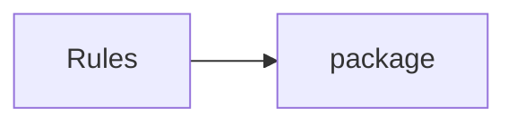

## When to Read
- editing or refactoring `ctxgraph--src-cli-io.mdc`
- editing or refactoring `ctxgraph--src-cli-program.mdc`
- editing or refactoring `ctxgraph--src-cli-version.mdc`
- editing or refactoring `ctxgraph--src-cli.mdc`

## Overview
- `.cursor/rules/ctxgraph--src-cli-io.mdc` (38 lines · 5 top-level symbols) — # When to Read
- `.cursor/rules/ctxgraph--src-cli-program.mdc` (59 lines · 1 top-level symbols) — # When to Read
- `.cursor/rules/ctxgraph--src-cli-version.mdc` (33 lines · 1 top-level symbols) — # When to Read
- `.cursor/rules/ctxgraph--src-cli.mdc` (44 lines) — # When to Read

## Graph


## Signatures

```typescript
// ── .cursor/rules/ctxgraph--src-cli-io.mdc ──
// ── src/cli/io.ts ──
export interface CliOutputOpts { quiet?: boolean; json?: boolean; }
export function createLoggers(opts: CliOutputOpts) { const quiet = opts.quiet ?? false; const jsonOutput = opts.json ?? false; const log = (...args: unknown[]) => { if (!quiet && !jsonOutput) console.log(...args); }; return { quiet, json…
export function logResolvedProjectRoot( log: (...args: unknown[]) => void, projectRoot: string, opts: CliOutputOpts ) { if (opts.quiet || opts.json) return; const cw = path.resolve(process.cwd()); const pr = path.resolve(projectRoot); if…
export function formatCost(costUSD: number | null, inputTokens: number, outputTokens: number): string { const tokenStr = `${Math.round(inputTokens / 1000)}k in / ${Math.round(outputTokens / 1000)}k out`; if (costUSD === null) return chal…
/** Pre-push hook only: avoid enquirer (Node 20+ can throw ERR_USE_AFTER_CLOSE on confirm). */
export async function promptHookRunActualize(): Promise<boolean> { /* ~24 lines */ }

// ── .cursor/rules/ctxgraph--src-cli-program.mdc ──
// ── src/cli/program.ts ──
export const program = new Command();

// ── .cursor/rules/ctxgraph--src-cli-version.mdc ──
// ── src/cli/version.ts ──
export const PKG_VERSION: string = (require('../../package.json') as { version: string }).version;

```

## Dependencies
**External:**
- `package`
