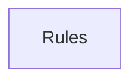

## When to Read
- editing or refactoring `ctxgraph--cursor-rules-bundle-p28.mdc`
- editing or refactoring `ctxgraph--cursor-rules-bundle-p29.mdc`

## Overview
- `.cursor/rules/ctxgraph--cursor-rules-bundle-p28.mdc` (79 lines · 12 top-level symbols) — # When to Read
- `.cursor/rules/ctxgraph--cursor-rules-bundle-p29.mdc` (49 lines · 4 top-level symbols) — # When to Read

## Graph


## Signatures

```typescript
// ── .cursor/rules/ctxgraph--cursor-rules-bundle-p28.mdc ──
// ── .cursor/rules/ctxgraph--src-source-extract-ts-prompt.mdc ──
// ── src/source-extract/ts-prompt.ts ──
/** Large string templates embedded in TS (LLM pass messages, not runtime logic). */
export function isPromptTemplateBody(text: string, filePath?: string): boolean { /* prompt template (~11 lines) */ }
/** One-line export for instruction graphs (collapse prompt bodies). */
export function compactTsExportLine(sf: ts.SourceFile, node: ts.Node, filePath?: string): string { /* ~18 lines */ }
// ── .cursor/rules/ctxgraph--src-source-extract-ts-skeleton.mdc ──
// ── src/source-extract/ts-skeleton.ts ──
/**
 * Function / method / composable skeleton from `<script>` or `.ts` (no LLM).
 * Expands `computed(() => { switch ... })` into readable structure.
 */
export function extractScriptSkeleton(script: string, virtualPath: string): string[] { /* prompt template (~178 lines) */ }
// ── .cursor/rules/ctxgraph--src-source-extract-utils.mdc ──
// ── src/source-extract/utils.ts ──
/** Shared limits for deterministic extractors. */
export const SKELETON_MAX_CHARS = 4200;
export function truncateSkeleton(s: string, max = 280): string { const t = s.replace(/\s+/g, ' ').trim(); return t.length > max ? `${t.slice(0, max - 1)}…` : t; }
// ── .cursor/rules/ctxgraph--src-source-extract-vue-sfc.mdc ──
// ── src/source-extract/vue-sfc.ts ──
export function extractVueScriptCombined(sfc: string): string { const re = /<script\b([^>]*)>([\s\S]*?)<\/script>/gi; const parts: string[] = []; let m: RegExpExecArray | null; while ((m = re.exec(sfc)) !== null) { const attrs = m[1] ?? …
/**
 * For `.vue`, return extracted script + a virtual `.ts` path for the TS parser.
 * Otherwise return the file as-is.
 */
export function scriptOrSelfForAnalysis( relPath: string, content: string ): { body: string; virtualPath: string } { const norm = relPath.replace(/\\/g, '/'); if (/\.vue$/i.test(norm)) { const script = extractVueScriptCombined(content); …
export function extractVuePropKeys(script: string): string[] { /* ~30 lines */ }
/**
 * Vue `<script setup>` symbols: props, composables, top-level const/ref/computed.
 * Used when there is no `export` (typical SFC).
 */
export function extractVueSymbolLines(script: string): string[] { /* ~39 lines */ }
/** One-line template summary for instruction graphs. */
export function extractVueTemplateBrief(sfc: string): string | null { const m = sfc.match(/<template\b[^>]*>([\s\S]*?)<\/template>/i); if (!m) return null; const one = (m[1] ?? '') .replace(/<!--[\s\S]*?-->/g, '') .replace(/\s+/g, ' ') .…
/**
 * Compact routing block for `.vue` in deterministic instructions.
 * No full script — names, props, runtime hooks only.
 */
export function buildVueRoutingSignatures(relPath: string, sfcContent: string): string[] { /* prompt template (~51 lines) */ }
/** Tag/element branches from `return` inside `computed` (e.g. LinkTag resolver). */
export function extractVueComputedBranches(script: string): string[] { /* ~17 lines */ }

// ── .cursor/rules/ctxgraph--cursor-rules-bundle-p29.mdc ──
// ── .cursor/rules/ctxgraph--src-writer.mdc ──
// ── src/writer.ts ──
export interface OutputFile { path: string; content: string; }
export interface WriteResult { created: string[]; updated: string[]; errors: { path: string; error: string }[]; }
/**
 * Parse LLM response with multiple fallback strategies for different output formats.
 * Tries in order:
 *   1. <<<FILE: path>>>...<<<EOF>>>
 *   2. <!-- FILE: path -->```...```
 *   3. ## FILE: path\n```...```
 *   4. ```path/to/file.ext\n...```
 */
export function parseOutputFiles(response: string): OutputFile[] { /* prompt template (~17 lines) */ }
export function writeOutputFiles(files: OutputFile[], projectRoot: string): WriteResult { /* ~33 lines */ }

```

## Dependencies
- No dependencies detected
