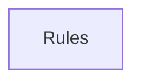

## When to Read
- editing or refactoring `ctxgraph--src-providers-openai.mdc`
- editing or refactoring `ctxgraph--src-providers-types.mdc`
- editing or refactoring `ctxgraph--src-scanner.mdc`
- editing or refactoring `ctxgraph--src-source-extract-go.mdc`

## Overview
- `.cursor/rules/ctxgraph--src-providers-openai.mdc` (36 lines · 1 top-level symbols) — # When to Read
- `.cursor/rules/ctxgraph--src-providers-types.mdc` (35 lines · 5 top-level symbols) — # When to Read
- `.cursor/rules/ctxgraph--src-scanner.mdc` (53 lines · 7 top-level symbols) — # When to Read
- `.cursor/rules/ctxgraph--src-source-extract-go.mdc` (33 lines · 2 top-level symbols) — # When to Read

## Graph


## Signatures

```typescript
// ── .cursor/rules/ctxgraph--src-providers-openai.mdc ──
// ── src/providers/openai.ts ──
export class OpenAIProvider implements LLMProvider { /* ~44 lines */ }

// ── .cursor/rules/ctxgraph--src-providers-types.mdc ──
// ── src/providers/types.ts ──
export interface LLMMessage { role: 'user' | 'assistant'; content: string; }
export interface LLMUsage { inputTokens: number; outputTokens: number; }
export interface LLMResponse { content: string; usage: LLMUsage; }
export interface LLMProvider { complete(systemPrompt: string, messages: LLMMessage[]): Promise<LLMResponse>; }
export interface ProviderConfig { provider: 'openai' | 'anthropic' | 'openai-compat' | 'ollama'; model: string; apiKeyEnv: string; baseUrl?: string; maxTokens?: number; }

// ── .cursor/rules/ctxgraph--src-scanner.mdc ──
// ── src/scanner.ts ──
/** Root files with gitignore-style rules, scanned after `.gitignore` / `.copilotignore`. */
export const GRAPH_CONTEXT_IGNORE_FILENAMES = ['.graph-context-ignore', '.context-graph-ignore'] as const;
export interface ScannedFile { path: string; tier: 0 | 1 | 2 | 3; content: string; lines: number; truncated: boolean; }
export interface ScanResult { tree: string; files: ScannedFile[]; tokenEstimate: number; fileCount: number; skippedCount: number; }
export function classifyFile(relPath: string): 0 | 1 | 2 | 3 { const normalized = relPath.replace(/\\/g, '/'); const parts = normalized.split('/'); const name = parts[parts.length - 1]; if (parts.some(p => TIER3_DIRS.has(p))) return 3; i…
export async function scanProject( projectRoot: string, maxFiles = 200, maxInputTokens = 80000, options?: { /* ~126 lines */ }
export function formatForLLM(scan: ScanResult): string { /* prompt template (~52 lines) */ }
/**
 * Returns a shallow copy of the scan with long file bodies truncated for LLM prompts.
 * Tier 0–2 only; Tier 3 unchanged. Does not replace full scan for `repairBuildPlan` / `buildMetadataJson`.
 */
export function scanForPromptDepth(scan: ScanResult, depth: 'full' | 'slim'): ScanResult { /* ~20 lines */ }

// ── .cursor/rules/ctxgraph--src-source-extract-go.mdc ──
// ── src/source-extract/go.ts ──
/** `import "path"`, `import alias "path"`, and `import ( ... )`. */
export function extractGoImports(go: string): string[] { /* ~43 lines */ }
export function extractGoSymbolLines(go: string): string[] { /* ~21 lines */ }

```

## Dependencies
- No dependencies detected
