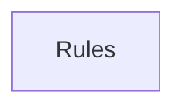

## When to Read
- editing or refactoring `ctxgraph--src-source-extract-php.mdc`
- editing or refactoring `ctxgraph--src-source-extract-python.mdc`
- editing or refactoring `ctxgraph--src-source-extract-ts-prompt.mdc`
- editing or refactoring `ctxgraph--src-source-extract-ts-skeleton.mdc`

## Overview
- `.cursor/rules/ctxgraph--src-source-extract-php.mdc` (45 lines · 6 top-level symbols) — # When to Read
- `.cursor/rules/ctxgraph--src-source-extract-python.mdc` (34 lines · 2 top-level symbols) — # When to Read
- `.cursor/rules/ctxgraph--src-source-extract-ts-prompt.mdc` (45 lines · 2 top-level symbols) — # When to Read
- `.cursor/rules/ctxgraph--src-source-extract-ts-skeleton.mdc` (48 lines · 1 top-level symbols) — # When to Read

## Graph


## Signatures

```typescript
// ── .cursor/rules/ctxgraph--src-source-extract-php.mdc ──
// ── src/source-extract/php.ts ──
/** PHP routing and symbol extraction. */
export function extractPhpSymbolLines(php: string): string[] { /* ~30 lines */ }
/** Balanced `(...)` after `function name` — supports multiline Laravel DI lists. */
export function extractPhpMethodParamNames(php: string, methodName: string): string[] { /* ~29 lines */ }
/** JSON / array keys from `return response()->json([...])` (routing hint, not full payload). */
export function extractPhpJsonResponseKeys(php: string): string[] { /* ~29 lines */ }
/**
 * Compact routing block for `.php` in deterministic instructions.
 * No full file — class, DI method summary, response keys, import count.
 */
export function buildPhpRoutingSignatures(relPath: string, php: string): string[] { /* prompt template (~63 lines) */ }
/** One-line index row for capped PHP folder bundles. */
export function buildPhpOneLineSummary(relPath: string, php: string): string { /* ~16 lines */ }
/** Top-level `use Foo\Bar;` / `use A, B;` — first segment only per clause. */
export function extractPhpUseStatements(php: string): string[] { const out: string[] = []; const s = php.replace(/\r\n/g, '\n'); const re = /^\s*use\s+([^;]+);/gm; let m: RegExpExecArray | null; while ((m = re.exec(s)) !== null) { const …

// ── .cursor/rules/ctxgraph--src-source-extract-python.mdc ──
// ── src/source-extract/python.ts ──
/** Python symbol and import extraction. */
export function extractPythonSymbolLines(py: string): string[] { /* ~21 lines */ }
/** `import x` / `from pkg import` / relative `from ... import` (dependency hints). */
export function extractPythonImports(py: string): string[] { /* ~29 lines */ }

// ── .cursor/rules/ctxgraph--src-source-extract-ts-prompt.mdc ──
// ── src/source-extract/ts-prompt.ts ──
/** Large string templates embedded in TS (LLM pass messages, not runtime logic). */
export function isPromptTemplateBody(text: string, filePath?: string): boolean { /* prompt template (~11 lines) */ }
/** One-line export for instruction graphs (collapse prompt bodies). */
export function compactTsExportLine(sf: ts.SourceFile, node: ts.Node, filePath?: string): string { /* ~18 lines */ }

// ── .cursor/rules/ctxgraph--src-source-extract-ts-skeleton.mdc ──
// ── src/source-extract/ts-skeleton.ts ──
/**
 * Function / method / composable skeleton from `<script>` or `.ts` (no LLM).
 * Expands `computed(() => { switch ... })` into readable structure.
 */
export function extractScriptSkeleton(script: string, virtualPath: string): string[] { /* prompt template (~178 lines) */ }

```

## Dependencies
- No dependencies detected
