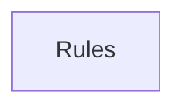

## When to Read
- editing or refactoring `ctxgraph--test-bundle-p3.mdc`
- editing or refactoring `ctxgraph--test-bundle.mdc`

## Overview
- `.cursor/rules/ctxgraph--test-bundle-p3.mdc` (42 lines · 1 top-level symbols) — # When to Read
- `.cursor/rules/ctxgraph--test-bundle.mdc` (71 lines · 2 top-level symbols) — # When to Read

## Graph


## Signatures

```typescript
// ── .cursor/rules/ctxgraph--test-bundle.mdc ──
// ── test/extract.test.mjs ──
/** Targets barrels only — not file purpose. */
export function extractReExportTargets() {}`;
 * Framework-aware deterministic extraction (no LLM).
 */
export function foo() {}`;

```

## Dependencies
- No dependencies detected
