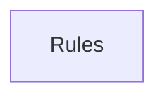

## When to Read
- editing or refactoring `ctxgraph--src-source-extract-ruby.mdc`
- editing or refactoring `ctxgraph--src-source-extract-rust.mdc`
- editing or refactoring `ctxgraph--src-source-extract-ts-prompt.mdc`
- editing or refactoring `ctxgraph--src-source-extract-ts-skeleton.mdc`

## Overview
- `.cursor/rules/ctxgraph--src-source-extract-ruby.mdc` (33 lines · 2 top-level symbols) — # When to Read
- `.cursor/rules/ctxgraph--src-source-extract-rust.mdc` (33 lines · 2 top-level symbols) — # When to Read
- `.cursor/rules/ctxgraph--src-source-extract-ts-prompt.mdc` (45 lines · 2 top-level symbols) — # When to Read
- `.cursor/rules/ctxgraph--src-source-extract-ts-skeleton.mdc` (48 lines · 1 top-level symbols) — # When to Read

## Graph


## Signatures

```typescript
// ── .cursor/rules/ctxgraph--src-source-extract-ruby.mdc ──
// ── src/source-extract/ruby.ts ──
/** Ruby symbol and require extraction. */
export function extractRubyImports(rb: string): string[] { const out: string[] = []; for (const rawLine of rb.replace(/\r\n/g, '\n').split('\n')) { const line = rawLine.split('#')[0].trim(); if (!line) continue; const req = line.match(/^…
export function extractRubySymbolLines(rb: string): string[] { /* ~20 lines */ }

// ── .cursor/rules/ctxgraph--src-source-extract-rust.mdc ──
// ── src/source-extract/rust.ts ──
/** Rust symbol and import extraction. */
export function extractRustImports(rs: string): string[] { /* ~17 lines */ }
export function extractRustSymbolLines(rs: string): string[] { /* ~23 lines */ }

// ── .cursor/rules/ctxgraph--src-source-extract-ts-prompt.mdc ──
// ── src/source-extract/ts-prompt.ts ──
/** Large string templates embedded in TS (LLM pass messages, not runtime logic). */
export function isPromptTemplateBody(text: string, filePath?: string): boolean { /* prompt template (~11 lines) */ }
/** One-line export for instruction graphs (collapse prompt bodies). */
export function compactTsExportLine(sf: ts.SourceFile, node: ts.Node, filePath?: string): string { /* ~18 lines */ }

// ── .cursor/rules/ctxgraph--src-source-extract-ts-skeleton.mdc ──
// ── src/source-extract/ts-skeleton.ts ──
/**
 * Function / method / composable skeleton from `<script>` or `.ts` (no LLM).
 * Expands `computed(() => { switch ... })` into readable structure.
 */
export function extractScriptSkeleton(script: string, virtualPath: string): string[] { /* prompt template (~178 lines) */ }

```

## Dependencies
- No dependencies detected
