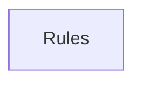

## When to Read
- editing or refactoring `ctxgraph--cursor-rules-bundle-p16.mdc`
- editing or refactoring `ctxgraph--cursor-rules-bundle-p17.mdc`

## Overview
- `.cursor/rules/ctxgraph--cursor-rules-bundle-p16.mdc` (73 lines · 22 top-level symbols) — # When to Read
- `.cursor/rules/ctxgraph--cursor-rules-bundle-p17.mdc` (80 lines · 22 top-level symbols) — # When to Read

## Graph


## Signatures

```typescript
// ── .cursor/rules/ctxgraph--cursor-rules-bundle-p16.mdc ──
// ── .cursor/rules/ctxgraph--src-graph-builder-deterministic-metadata.mdc ──
// ── src/graph-builder/deterministic/metadata.ts ──
export interface MetadataProjectSettings { buildStrategy?: string; instructionTargets?: string[]; installAgents?: boolean; }
export function buildMetadataJson( today: string, scan: ScanResult, plan?: BuildPlan, projectSettings?: MetadataProjectSettings ): string { /* ~58 lines */ }
/** Flat table: every instruction path ↔ applyTo ↔ sources (for LLMs and search). */
export function buildContextGraphPathIndexMd(today: string, plan: BuildPlan): string { /* prompt template (~20 lines) */ }
/** Build index.md content from plan subsystems — no LLM guessing */
export function buildIndexMd(today: string, plan?: BuildPlan): string { /* prompt template (~43 lines) */ }
// ── .cursor/rules/ctxgraph--src-graph-builder-deterministic-root-project.mdc ──
// ── src/graph-builder/deterministic/root-project.ts ──
export function buildHowToUseGraphSection( plan: BuildPlan, profile: ProjectStackProfile ): string[] { /* prompt template (~28 lines) */ }
export function buildCodeZonesSection(plan: BuildPlan, profile: ProjectStackProfile): string[] { /* prompt template (~53 lines) */ }
export function buildProjectDataFlowSection( scan: ScanResult, profile: ProjectStackProfile ): string[] { /* prompt template (~62 lines) */ }
export interface NavZonePick { zone: string; subsystem: BuildPlanItem; }
/** Zone-aware highlights for slim root (Laravel API first, not random P0 Vue). */
export function pickZoneNavigationHighlights( plan: BuildPlan, profile: ProjectStackProfile, maxTotal: number ): string[] { /* prompt template (~63 lines) */ }
export function getProjectStackProfile(scan: ScanResult): ProjectStackProfile { return detectProjectStackProfile(scan); }
// ── .cursor/rules/ctxgraph--src-graph-builder-deterministic-root-slim.mdc ──
// ── src/graph-builder/deterministic/root-slim.ts ──
export interface CopilotRootOptions { /** Force slim root (e.g. `contextDepth: slim`). Auto when subsystems ≥ threshold. */ slimRoot?: boolean; }
export function resolveRootSlimMode(plan: BuildPlan, opts?: CopilotRootOptions): boolean { if (opts?.slimRoot === true) return true; if (opts?.slimRoot === false) return false; if (plan.subsystems.length >= ROOT_SLIM_AUTO_SUBSYSTEM_THRES…
/** Directory key for grouping (up to 3 segments under repo root). */
export function sourceDirGroupKey(sourcePath: string): string { const norm = sourcePath.replace(/\\/g, '/'); if (!norm.includes('/')) return '.'; const parts = path.posix.dirname(norm).split('/').filter(Boolean); const depth = parts[0] =…
export interface DirGroupSummary { dir: string; subsystemCount: number; sourceFileCount: number; bestPriority: BuildPlanItem['priority']; }
export function summarizeSubsystemDirGroups(plan: BuildPlan): DirGroupSummary[] { /* ~26 lines */ }
export function buildQuickNavigationLines( plan: BuildPlan, slim: boolean, scan?: ScanResult ): string[] { /* prompt template (~92 lines) */ }
export function buildSlimArchitectureOverviewLines(plan: BuildPlan): string[] { /* prompt template (~24 lines) */ }
// ── .cursor/rules/ctxgraph--src-graph-builder-deterministic-root.mdc ──
// ── src/graph-builder/deterministic/root.ts ──
export type { CopilotRootOptions }
export function buildDeterministicCopilotInstructions( today: string, scan: ScanResult, plan: BuildPlan, rootOpts?: CopilotRootOptions ): string { /* prompt template (~142 lines) */ }
export function buildDeterministicChangelog(today: string, plan: BuildPlan): string { const lines = [ `# Context Graph — Changelog`, ``, `## ${today} — Initial Build`, ``, `Subsystems created:`, ...plan.subsystems.map(s => `- \`${s.file}…
/** Standard scan-exclusion hints — never infer top-level dirs from nested lockfiles. */
export function buildDeterministicCopilotIgnore(_scan?: ScanResult): string { return [ '# Managed by context-graph — scan exclusions (gitignore syntax; ** = any depth)', '# For project-specific paths use .graph-context-ignore (does not o…
export function injectDeterministicRootFiles( today: string, scan: ScanResult, plan: BuildPlan, files: OutputFile[], llmCopilotContent?: string, rootOpts?: CopilotRootOptions, instructionTargets: I… { /* prompt template (~190 lines) */ }

// ── .cursor/rules/ctxgraph--cursor-rules-bundle-p17.mdc ──
// ── .cursor/rules/ctxgraph--src-graph-builder-deterministic-routing-mandate.mdc ──
// ── src/graph-builder/deterministic/routing-mandate.ts ──
/** Imperative routing copy (MUST / BLOCKING) — no "when", "should", "prefer". */
export const ROUTING_MANDATE_HEADING = '## MANDATORY — read instructions first (BLOCKING)';
/** When user names a component/file in chat (LinkTag, useSeo) — no file open. */
export function buildNamedEntityRoutingMandate(): string[] { /* prompt template (~16 lines) */ }
/** Shared 5-step BLOCKING workflow. */
export function buildRoutingWorkflowSteps(examplePath?: string): string[] { /* prompt template (~18 lines) */ }
/** After "## How to use this graph" in copilot-instructions.md */
export function buildCopilotGraphMandate(examplePath: string): string[] { return [ ROUTING_MANDATE_HEADING, ``, ...buildNamedEntityRoutingMandate(), ...buildRoutingWorkflowSteps(examplePath), `**GitHub Copilot (VS Code / JetBrains / Copi…
/** Top of CLAUDE.md / AGENTS.md / GEMINI.md — immediately after title. */
export function buildAgentEntryMandate(): string[] { return [ ROUTING_MANDATE_HEADING, ``, ...buildNamedEntityRoutingMandate(), ...buildRoutingWorkflowSteps(), ]; }
export type AgentEntryTool = | 'claude' | 'agents' | 'gemini' | 'codex' | 'windsurf' | 'cline' | 'copilot';
/** Tool-specific lines after shared mandate (docs-backed, May 2026). */
export function buildToolSpecificRoutingLines(tool: AgentEntryTool): string[] { /* prompt template (~71 lines) */ }
export function buildAgentEntryWithTool(title: string, tool: AgentEntryTool): string[] { return [ `# ${title}`, ``, ...buildAgentEntryMandate(), ...buildToolSpecificRoutingLines(tool), ]; }
/** Cursor always-on router rule body (no frontmatter). */
export function buildCursorRouterMandate(): string[] { return [ `## MANDATORY routing (BLOCKING)`, ``, `**MUST** follow attached \`ctxgraph--*\` rule when \`globs\` match the file you edit.`, `If none attached: **MUST** complete path-ind…
/** Windsurf: always_on trigger (docs.windsurf.com — rules in .windsurf/rules/). */
export function buildWindsurfContextGraphRule(): string { const body = [ `# context-graph — Windsurf routing (always on)`, ``, ...buildNamedEntityRoutingMandate(), ...buildRoutingWorkflowSteps(), ...buildToolSpecificRoutingLines('windsur…
/** Cline workspace rule (no standard always-on frontmatter). */
export function buildClineContextGraphRule(): string { return [ `# context-graph — Cline routing`, ``, ...buildRoutingWorkflowSteps(), ...buildToolSpecificRoutingLines('cline'), `## Also load`, ``, `- \`.github/instructions/copilot-instr…
/** Codex supplemental doc (AGENTS.md is primary). */
export function buildCodexContextGraphRule(): string { return [ `# context-graph — Codex supplement`, ``, `**MUST** read \`AGENTS.md\` at repo root first — Codex loads it before every run.`, ``, ...buildRoutingWorkflowSteps(), ...buildTo…
/** Compact matrix for copilot-instructions / human reference. */
export function buildAiToolRoutingReferenceSection(): string[] { /* prompt template (~22 lines) */ }
// ── .cursor/rules/ctxgraph--src-graph-builder-deterministic-subsystem.mdc ──
// ── src/graph-builder/deterministic/subsystem.ts ──
export function buildDeterministicSubsystemFile( today: string, instructionPath: string, planItem: BuildPlanItem | undefined, scan: ScanResult, sourceFiles: string[] ): OutputFile { /* prompt template (~300 lines) */ }
// ── .cursor/rules/ctxgraph--src-graph-builder-discovery.mdc ──
// ── src/graph-builder/discovery.ts ──
export function parseSubsystemMappings(generatedFiles: OutputFile[]): SubsystemMapping[] { /* ~28 lines */ }
/** Fallback: extract subsystem paths from markdown links (old format) */
export function findMissingSubsystemPaths(generatedFiles: OutputFile[]): string[] { /* ~16 lines */ }
// ── .cursor/rules/ctxgraph--src-graph-builder-extract-deps-graph.mdc ──
// ── src/graph-builder/extract/deps-graph.ts ──
export const TS_JS_EXTS = ['.ts', '.tsx', '.js', '.jsx', '.mjs', '.cjs', '.vue', '.go', '.py'];
export function isTsJsLikePath(p: string): boolean { return /\.(ts|tsx|js|jsx|mjs|cjs|vue)$/i.test(p); }
export function stripKnownExt(p: string): string { return p.replace(/\.(ts|tsx|js|jsx|mjs|cjs|vue|go|py)$/i, ''); }
export function extractImportSpecifiersFromTsAst(filePath: string, content: string): string[] { /* ~29 lines */ }
export function resolveInternalImport( fromFile: string, spec: string, existingPaths: Set<string> ): string | null { /* ~30 lines */ }
export function buildDeterministicDependencyGraph( scan: ScanResult, opts?: { /* prompt template (~129 lines) */ }

```

## Dependencies
- No dependencies detected
