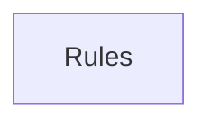

## When to Read
- editing or refactoring `ctxgraph--src-graph-builder-cost.mdc`
- editing or refactoring `ctxgraph--src-graph-builder-deterministic-cursor-rules.mdc`
- editing or refactoring `ctxgraph--src-graph-builder-deterministic-metadata.mdc`
- editing or refactoring `ctxgraph--src-graph-builder-deterministic-root-project.mdc`

## Overview
- `.cursor/rules/ctxgraph--src-graph-builder-cost.mdc` (35 lines · 1 top-level symbols) — # When to Read
- `.cursor/rules/ctxgraph--src-graph-builder-deterministic-cursor-rules.mdc` (47 lines · 5 top-level symbols) — # When to Read
- `.cursor/rules/ctxgraph--src-graph-builder-deterministic-metadata.mdc` (42 lines · 4 top-level symbols) — # When to Read
- `.cursor/rules/ctxgraph--src-graph-builder-deterministic-root-project.mdc` (47 lines · 6 top-level symbols) — # When to Read

## Graph


## Signatures

```typescript
// ── .cursor/rules/ctxgraph--src-graph-builder-cost.mdc ──
// ── src/graph-builder/cost.ts ──
export function estimateCost(model: string, usage: LLMUsage): number | null { const pricing = PRICING[model]; if (!pricing) { const key = Object.keys(PRICING).find(k => model.startsWith(k)); if (!key) return null; const p = PRICING[key];…

// ── .cursor/rules/ctxgraph--src-graph-builder-deterministic-cursor-rules.mdc ──
// ── src/graph-builder/deterministic/cursor-rules.ts ──
/** Strip YAML frontmatter from subsystem instruction markdown. */
export function stripInstructionFrontmatter(md: string): string { if (!md.startsWith('---')) return md.trim(); const end = md.indexOf('\n---', 3); if (end === -1) return md.trim(); const after = md.indexOf('\n', end + 4); return (after =…
/** `applyTo` from plan → Cursor `globs` string (comma-separated). */
export function applyToToCursorGlobs(applyTo: string): string { const parts = applyTo .split(',') .map(s => s.trim()) .filter(Boolean); if (parts.length === 0) return '**/*'; return parts .map(p => p.replace(/\\/g, '/')) .join(', '); }
export function slugFromInstructionFile(instructionRel: string): string { const base = instructionRel.replace(/\.instructions\.md$/i, ''); const slug = base.replace(/[^a-zA-Z0-9]+/g, '-').replace(/^-+|-+$/g, ''); const name = `${RULE_PRE…
export function buildCursorRuleMdc( planItem: BuildPlanItem, instructionRelPath: string, instructionBody: string ): string { /* prompt template (~24 lines) */ }
/**
 * Emit one \`.cursor/rules/ctxgraph--<slug>.mdc\` per subsystem so Cursor auto-loads
 * instructions without asking the model to open files manually.
 */
export function appendCursorRuleFiles( plan: BuildPlan, files: OutputFile[], instructionTargets: InstructionTargetId[] = [] ): void { /* prompt template (~48 lines) */ }

// ── .cursor/rules/ctxgraph--src-graph-builder-deterministic-metadata.mdc ──
// ── src/graph-builder/deterministic/metadata.ts ──
export interface MetadataProjectSettings { buildStrategy?: string; instructionTargets?: string[]; installAgents?: boolean; }
export function buildMetadataJson( today: string, scan: ScanResult, plan?: BuildPlan, projectSettings?: MetadataProjectSettings ): string { /* ~58 lines */ }
/** Flat table: every instruction path ↔ applyTo ↔ sources (for LLMs and search). */
export function buildContextGraphPathIndexMd(today: string, plan: BuildPlan): string { /* prompt template (~20 lines) */ }
/** Build index.md content from plan subsystems — no LLM guessing */
export function buildIndexMd(today: string, plan?: BuildPlan): string { /* prompt template (~43 lines) */ }

// ── .cursor/rules/ctxgraph--src-graph-builder-deterministic-root-project.mdc ──
// ── src/graph-builder/deterministic/root-project.ts ──
export function buildHowToUseGraphSection( plan: BuildPlan, profile: ProjectStackProfile ): string[] { /* prompt template (~28 lines) */ }
export function buildCodeZonesSection(plan: BuildPlan, profile: ProjectStackProfile): string[] { /* prompt template (~53 lines) */ }
export function buildProjectDataFlowSection( scan: ScanResult, profile: ProjectStackProfile ): string[] { /* prompt template (~62 lines) */ }
export interface NavZonePick { zone: string; subsystem: BuildPlanItem; }
/** Zone-aware highlights for slim root (Laravel API first, not random P0 Vue). */
export function pickZoneNavigationHighlights( plan: BuildPlan, profile: ProjectStackProfile, maxTotal: number ): string[] { /* prompt template (~63 lines) */ }
export function getProjectStackProfile(scan: ScanResult): ProjectStackProfile { return detectProjectStackProfile(scan); }

```

## Dependencies
- No dependencies detected
