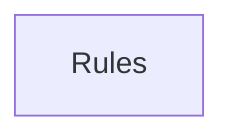

## When to Read
- editing or refactoring `ctxgraph--src-cli-commands-actualize.mdc`
- editing or refactoring `ctxgraph--src-cli-commands-agents.mdc`
- editing or refactoring `ctxgraph--src-cli-commands-build.mdc`
- editing or refactoring `ctxgraph--src-cli-commands-hook-check.mdc`

## Overview
- `.cursor/rules/ctxgraph--src-cli-commands-actualize.mdc` (59 lines · 1 top-level symbols) — # When to Read
- `.cursor/rules/ctxgraph--src-cli-commands-agents.mdc` (49 lines · 1 top-level symbols) — # When to Read
- `.cursor/rules/ctxgraph--src-cli-commands-build.mdc` (65 lines · 1 top-level symbols) — # When to Read
- `.cursor/rules/ctxgraph--src-cli-commands-hook-check.mdc` (56 lines · 1 top-level symbols) — # When to Read

## Graph


## Signatures

```typescript
// ── .cursor/rules/ctxgraph--src-cli-commands-actualize.mdc ──
// ── src/cli/commands/actualize.ts ──
export function registerActualizeCommand(program: Command): void { /* ~102 lines */ }

// ── .cursor/rules/ctxgraph--src-cli-commands-agents.mdc ──
// ── src/cli/commands/agents.ts ──
export function registerAgentsCommand(program: Command): void { /* ~77 lines */ }

// ── .cursor/rules/ctxgraph--src-cli-commands-build.mdc ──
// ── src/cli/commands/build.ts ──
export function registerBuildCommand(program: Command): void { /* ~244 lines */ }

// ── .cursor/rules/ctxgraph--src-cli-commands-hook-check.mdc ──
// ── src/cli/commands/hook-check.ts ──
export function registerHookCheckCommand(program: Command): void { /* ~69 lines */ }

```

## Dependencies
- No dependencies detected

## Danger Zone 🔴
- **[env]** reads `process.env.CONTEXT_GRAPH_PROVIDER`
- **[env]** reads `process.env.CONTEXT_GRAPH_MODEL`
