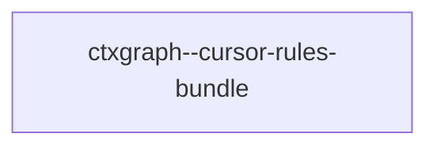

## When to Read
- editing or refactoring `ctxgraph--cursor-rules-bundle.mdc`

## Overview
- `.cursor/rules/ctxgraph--cursor-rules-bundle.mdc` (100 lines · 19 top-level symbols) — # When to Read

## Graph


## Signatures

```typescript
// ── .cursor/rules/ctxgraph--cursor-rules-bundle.mdc ──
/**
 * Curated index of agency-agents (https://github.com/msitarzewski/agency-agents).
 *
 * Each entry describes:
 *   - where the .md file lives in the upstream repo
 *   - what project signals trigger a match
 *   - a short description for the generated README
 */
export interface AgentEntry { /* ~16 lines */ }
export interface AgentMatchRule { /** File extensions present in the project (e.g. ['.ts', '.tsx']) */ extensions?: string[]; /** File/dir names that indicate relevance (e.g. ['Dockerfile', 'docker-compose']) */ filePatterns?: RegExp[]; …
export const AGENTS_CATALOG: AgentEntry[] = [ // ── Engineering ─────────────────────────────────────────────────────────── { /* prompt template (~295 lines) */ }
/** Maximum agents to recommend by default */
export const MAX_RECOMMENDED_AGENTS = 10;
// ── .cursor/rules/ctxgraph--src-agents.mdc ──
// ── src/agents.ts ──
/**
 * Rank all catalog agents against the scanned project and return the top N.
 */
export function matchAgents( scan: ScanResult, plan?: BuildPlan, maxAgents = MAX_RECOMMENDED_AGENTS, ): AgentEntry[] { const ctx = buildMatchContext(scan, plan); const scored = AGENTS_CATALOG .map(entry => ({ entry, score: scoreAgent(ent…
export interface FetchedAgent { slug: string; name: string; description: string; usage: string; category: string; content: string; }
/**
 * Download agent .md files from the upstream repo.
 * Failures are logged but don't break the build.
 */
export async function fetchAgents( entries: AgentEntry[], onProgress?: (done: number, total: number, name: string) => void, ): Promise<FetchedAgent[]> { /* ~30 lines */ }
export interface AgentsWriteResult { created: string[]; updated: string[]; readmePath: string; }
/**
 * Write fetched agents to .github/agents/ and generate a README.
 */
export function writeAgents( agents: FetchedAgent[], projectRoot: string, ): AgentsWriteResult { /* ~27 lines */ }
// ── .cursor/rules/ctxgraph--cursor-rules-bundle-p11.mdc ──
// ── .cursor/rules/ctxgraph--src-cli-agents-install.mdc ──
// ── src/cli/agents-install.ts ──
export async function installRecommendedAgents( scan: ScanResult, plan: BuildPlan | null | undefined, projectRoot: string, opts: { /* ~33 lines */ }
// ── .cursor/rules/ctxgraph--src-cli-build-run.mdc ──
// ── src/cli/build-run.ts ──
export function resolveBuildStrategy( config: Config, opts: { /* ~22 lines */ }
export interface RunGraphBuildOpts { strategy: BuildStrategy; effectiveHybridMax: number; quiet: boolean; jsonOutput: boolean; getSpinner: () => Ora | null; setSpinner: (spinner: Ora | null) => void; }
export async function runGraphBuild( scan: ScanResult, config: Config, opts: RunGraphBuildOpts ): Promise<MultiPassResult> { /* ~84 lines */ }
// ── .cursor/rules/ctxgraph--src-cli-commands-actualize.mdc ──
// ── src/cli/commands/actualize.ts ──
export function registerActualizeCommand(program: Command): void { /* ~102 lines */ }
// ── .cursor/rules/ctxgraph--src-cli-commands-agents.mdc ──
// ── src/cli/commands/agents.ts ──
export function registerAgentsCommand(program: Command): void { /* ~77 lines */ }
// ── .cursor/rules/ctxgraph--cursor-rules-bundle-p12.mdc ──
// ── .cursor/rules/ctxgraph--src-cli-commands-build.mdc ──
// ── src/cli/commands/build.ts ──
export function registerBuildCommand(program: Command): void { /* ~279 lines */ }
// ── .cursor/rules/ctxgraph--src-cli-commands-hook-check.mdc ──
// ── src/cli/commands/hook-check.ts ──
export function registerHookCheckCommand(program: Command): void { /* ~69 lines */ }
// ── .cursor/rules/ctxgraph--src-cli-commands-impact.mdc ──
// ── src/cli/commands/impact.ts ──
export function registerImpactCommand(program: Command): void { /* ~33 lines */ }
// ── .cursor/rules/ctxgraph--src-cli-commands-resolve.mdc ──
// ── src/cli/commands/resolve.ts ──
export function registerResolveCommand(program: Command): void { /* ~38 lines */ }

```

## Dependencies
- No dependencies detected

## Danger Zone 🔴
- **[env]** reads `process.env.CONTEXT_GRAPH_PROVIDER`
- **[env]** reads `process.env.CONTEXT_GRAPH_MODEL`
