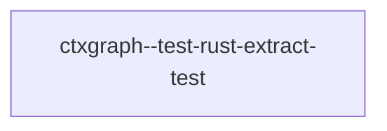

## When to Read
- editing or refactoring `ctxgraph--test-rust-extract-test.mdc`

## Overview
- `.cursor/rules/ctxgraph--test-rust-extract-test.mdc` (34 lines) — # When to Read

## Graph


## Signatures

```typescript
(no exports — see ## Source for full script)
```

## Source

### `.cursor/rules/ctxgraph--test-rust-extract-test.mdc`

_Prompt/message module — see ## Signatures; open repo file to edit templates._

## Dependencies
- No dependencies detected
