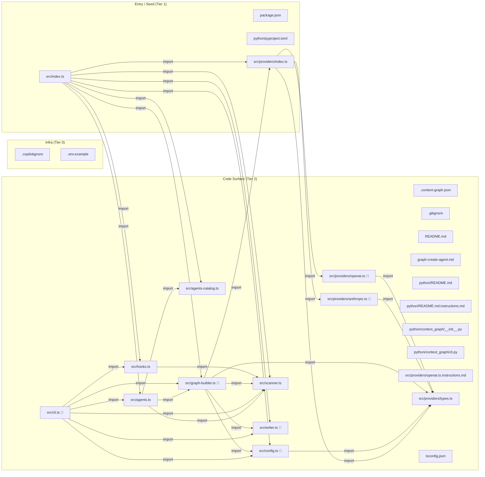

# context-graph — Project Context Graph

_Generated: 2026-05-05 · Stack: Node.js, TypeScript, Python_

## Quick Navigation

**Context Graph** → `.github/instructions/python_context_graph/bundle_p1.instructions.md`
  When: editing or refactoring `__init__.py` · editing or refactoring `cli.py`
**Agents Catalog** → `.github/instructions/core/agents-catalog.instructions.md`
  When: editing or refactoring `agents-catalog.ts`
**Agents** → `.github/instructions/core/agents.instructions.md`
  When: editing or refactoring `agents.ts`
**Cli** → `.github/instructions/core/cli.instructions.md`
  When: editing or refactoring `cli.ts`
**Config** → `.github/instructions/core/config.instructions.md`
  When: editing or refactoring `config.ts`
**Graph Builder** → `.github/instructions/core/graph-builder.instructions.md`
  When: editing or refactoring `graph-builder.ts`
**Hooks** → `.github/instructions/core/hooks.instructions.md`
  When: editing or refactoring `hooks.ts`
**Index** → `.github/instructions/core/index.instructions.md`
  When: editing or refactoring `index.ts`
**Scanner** → `.github/instructions/core/scanner.instructions.md`
  When: editing or refactoring `scanner.ts`
**Writer** → `.github/instructions/core/writer.instructions.md`
  When: editing or refactoring `writer.ts`
**LLM Providers** → `.github/instructions/infra/providers.instructions.md`
  When: editing or refactoring `anthropic.ts` · editing or refactoring `index.ts` · editing or refactoring `openai.ts`

## Environment

- **Build:** `npm run build`
- **Test:** `(no test script detected)`
- **Stack:** Node.js, TypeScript, Python

## Workflows (no LLM required)

- **Build instructions**: `context-graph build --no-llm` (writes deterministic graph + installs hook).
- **Update instructions**: `context-graph actualize --all --dry-run` (preview) → drop `--dry-run` (apply).
- **CI check**: `context-graph validate` (exit 1 if instructions outdated).
- **On push**: pre-push hook runs `context-graph hook-check` (reminder; never blocks push).

## Config & Precedence

- **Main config**: `.context-graph.json` (created by `context-graph build` if missing).
- **Overrides**: CLI flags `--provider/--model` (highest precedence for build).
- **Env overrides**: `CONTEXT_GRAPH_PROVIDER`, `CONTEXT_GRAPH_MODEL` (read from `.env` / env).
- **API key**: env var from config (`provider.apiKeyEnv`); Ollama allows missing key.

## Architecture Overview

## Notes (LLM)

```
- Root instructions for context-graph project.
- Start with /src/index.ts for main entry point.
- Python wrapper in /python/context_graph/cli.py depends on Node.js CLI.
- Catalog of agents in agents-catalog.ts describes project signals and usage scenarios.
- Agents defined in agents.ts integrate with project signals to trigger recommendations.
- Scanner component in src/scanner.ts detects project signals using match rules.
- Writer component in src/writer.ts outputs recommendations based on detected signals.
- Known issue: Node.js >=18 required for Python wrapper.
- Failure to locate Node.js or CLI results in error messages.
- For debugging, check /python/context_graph/cli.py implementation details.
```


Auto-generate AI context graphs for any codebase. One command, zero config.

- **Context Graph** (`python/context_graph/__init__.py`, `python/context_graph/cli.py`) — Context Graph — bundle under python/context_graph (2 files)
- **Agents Catalog** (`src/agents-catalog.ts`) — Agents Catalog — src/agents-catalog.ts
  - `agents-catalog.ts`: Curated index of agency-agents (https://github.com/msitarzewski/agency-agents).
- **Agents** (`src/agents.ts`) — Agents — src/agents.ts
- **Cli** (`src/cli.ts`) — Cli — src/cli.ts
- **Config** (`src/config.ts`) — Config — src/config.ts
  - `config.ts`: `slim` = smaller prompts for local LLMs (truncated bodies + shorter root pass).
- **Graph Builder** (`src/graph-builder.ts`) — Graph Builder — src/graph-builder.ts
- **Hooks** (`src/hooks.ts`) — Hooks — src/hooks.ts
- **Index** (`src/index.ts`) — Index — src/index.ts
  - `index.ts`: Programmatic API — for embedding context-graph in other tools
- **Scanner** (`src/scanner.ts`) — Scanner — src/scanner.ts
- **Writer** (`src/writer.ts`) — Writer — src/writer.ts
  - `writer.ts`: Parse LLM response with multiple fallback strategies for different output formats.
- **LLM Providers** (`src/providers/anthropic.ts`, `src/providers/index.ts`, `src/providers/openai.ts`, `src/providers/types.ts`) — All modules under src/providers

## Dependency Graph



## Data Flow

Entry points: `src/index.ts` → `src/providers/index.ts`

- **BUILD**: scanProject → buildGraphMultiPass/hybrid/deterministic → writeOutputFiles → saveLastBuildRef.
- **ACTUALIZE**: git diff since last ref → scanProject → buildGraph(mode=ACTUALIZE) → writeOutputFiles → saveLastBuildRef.
- **VALIDATE**: git diff since last ref → filterSignificantFiles → exit 1 if outdated.

## Module Contracts

- **Source of truth**: per-subsystem `*.instructions.md` files (open via Quick Navigation / index.md).
- **Root policy**: do not embed large signatures here; keep root fast to load.

## Danger Zones 🔴

- `src/cli.ts` — reads environment variables
- `src/config.ts` — reads environment variables
- `src/graph-builder.ts` — reads environment variables
- `src/providers/anthropic.ts` — reads environment variables
- `src/providers/openai.ts` — reads environment variables

## Troubleshooting

- **Graph missing**: run `context-graph build --no-llm` (creates `.github/instructions/`).
- **Validate fails**: run `context-graph actualize --all` then commit instruction changes.
- **Actualize returns no files**: try `--all`; LLM mode needs configured provider/model/key.
- **Output parse issues**: model must emit only `<<<FILE: ...>>>` blocks (no prose).

---
_This file is auto-generated by context-graph. Descriptive prose is enriched by LLM when available._