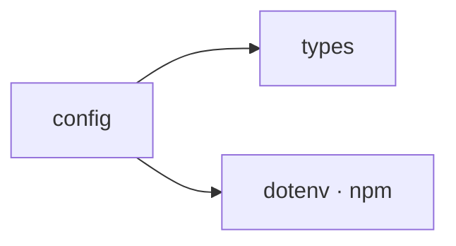

## When to Read
- editing or refactoring `config.ts`

## Overview
- `src/config.ts` (288 lines · 10 exports) — `slim` = smaller prompts for local LLMs (truncated bodies + shorter root pass).

## Graph


## Signatures

### Notes (LLM)

```markdown

>>>
**Config**

- **MODEL_MAX_OUTPUT_TOKENS**: Define max tokens for AI resp. unknown.
- **getModelMaxTokens**: Retrieve current token limit. unknown.
- **initConfig**: Initialize config settings. unknown.
- **initConfigInteractive**: Init with user input. unknown.
- **loadConfig**: Load config from file or defaults. unknown.
- **providerAllowsMissingApiKey**: Check if provider accepts missing API key. unknown.

<<<EOF>>>
```


```typescript
// ── src/config.ts ──
export type ContextDepth = 'full' | 'slim';
export type BuildStrategy = 'llm' | 'hybrid' | 'deterministic';
export type OutputStyle = 'normal' | 'compact';
export interface Config { provider: ProviderConfig; maxFiles: number; maxInputTokens: number; contextDepth: ContextDepth; buildStrategy: BuildStrategy; /** Hybrid: how many subsystems get LLM notes (root always gets notes). */ hybridMaxS…
export const MODEL_MAX_OUTPUT_TOKENS: Record<string, number> = { 'gpt-4o': 16384, 'gpt-4o-mini': 16384, 'gpt-4.1': 32768, 'gpt-4.1-mini': 32768, 'o1': 100000, 'o1-mini': 65536, 'o3': 100000, 'o3-mini': 100000, 'claude-opus-4': 32768, 'cl…
export function getModelMaxTokens(model: string): number { // Exact match first, then prefix match (e.g. 'gpt-4o-2024-11-20' → 'gpt-4o') if (MODEL_MAX_OUTPUT_TOKENS[model]) return MODEL_MAX_OUTPUT_TOKENS[model]; for (const key of Object.…
export function providerAllowsMissingApiKey(provider: ProviderConfig['provider']): boolean { return provider === 'ollama'; }
export function loadConfig(projectRoot: string): Config { dotenv.config({ path: path.join(projectRoot, '.env') }); if (projectRoot !== process.cwd()) { dotenv.config({ path: path.join(process.cwd(), '.env') }); } const configPath = path.…
export function initConfig( projectRoot: string, providerName?: string, model?: string ): boolean { const configPath = path.join(projectRoot, '.context-graph.json'); if (fs.existsSync(configPath)) return false; const provider = providerN…
export async function initConfigInteractive(projectRoot: string): Promise<boolean> { const configPath = path.join(projectRoot, '.context-graph.json'); if (fs.existsSync(configPath)) return false; try { // eslint-disable-next-line @typesc…

```

## Dependencies
**Internal:**
- `src/providers/types`

**External (npm):**
- `dotenv`

## Error Handling
- `Error`: "Invalid .context-graph.json: ${(e as Error).message}" (`config.ts`)

## Danger Zone 🔴
- Reads `process.env.CONTEXT_GRAPH_PROVIDER`
- Reads `process.env.CONTEXT_GRAPH_BASE_URL`
- Reads `process.env.CONTEXT_GRAPH_CONTEXT_DEPTH`
- Reads `process.env.CONTEXT_GRAPH_BUILD_STRATEGY`
- Reads `process.env.CONTEXT_GRAPH_HYBRID_MAX_SUBSYSTEMS`
- Reads `process.env.CONTEXT_GRAPH_HYBRID_NOTES_MODE`
- Reads `process.env.CONTEXT_GRAPH_OUTPUT_STYLE`
- Reads `process.env.CONTEXT_GRAPH_MODEL`
- Reads `process.env.CONTEXT_GRAPH_MAX_OUTPUT_TOKENS`
- Reads `process.env.CONTEXT_GRAPH_MAX_FILES`
- Reads `process.env.CONTEXT_GRAPH_MAX_INPUT_TOKENS`