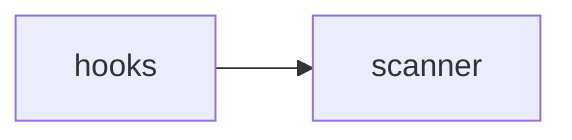

## When to Read
- editing or refactoring `hooks.ts`

## Overview
- `src/hooks.ts` (98 lines · 4 exports) — Hooks — src/hooks.ts

## Graph


## Signatures

### Notes (LLM)

```
- **installPrePushHook**: Installs a pre-push git hook to manage context graph. Skips if already managed or hooks directory does not exist.
- **saveLastBuildRef**: Saves the commit hash of the last successful build or the current timestamp to a file.
- **getChangedFilesSinceLastBuild**: Retrieves files changed since the last build, using either a commit hash or a date.
- **filterSignificantFiles**: Filters an array of file paths to include only those categorized as Tier 0, Tier 1, or Tier 2 files.
```


```typescript
// ── src/hooks.ts ──
export function installPrePushHook(projectRoot: string): 'installed' | 'updated' | 'skipped' { const hooksDir = path.join(projectRoot, '.git', 'hooks'); if (!fs.existsSync(hooksDir)) return 'skipped'; const hookPath = path.join(hooksDir,…
export function saveLastBuildRef(projectRoot: string): void { const refFile = path.join(projectRoot, '.context-graph-last-build'); try { const sha = execSync('git rev-parse HEAD', { cwd: projectRoot, encoding: 'utf8', stdio: ['ignore', '…
export function getChangedFilesSinceLastBuild(projectRoot: string): string[] { const refFile = path.join(projectRoot, '.context-graph-last-build'); if (!fs.existsSync(refFile)) return []; const ref = fs.readFileSync(refFile, 'utf8').trim…
export function filterSignificantFiles(files: string[]): string[] { return files.filter(f => { const tier = classifyFile(f); return tier === 0 || tier === 1 || tier === 2; }); }

```

## Dependencies
**Internal:**
- `src/scanner`

## Error Handling
- No explicit throws detected

## Danger Zone 🔴
- No env vars or side effects detected