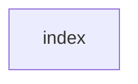

## When to Read
- editing or refactoring `index.ts`

## Overview
- `src/index.ts` (35 lines · 15 exports) — Programmatic API — for embedding context-graph in other tools

## Graph


## Signatures

### Notes (LLM)

```markdown
- **loadConfig**: Load configuration settings for the context graph.
  - Gotcha: Ensure config file is accessible and correctly formatted.

- **initConfig**: Initialize the configuration with default values or provided values.
  - Failure mode: Configuration errors could prevent app from starting.

- **initConfigInteractive**: Interactive setup for initializing configuration parameters.
  - Failure mode: User input errors can cause initialization to fail.

- **getModelMaxTokens**: Get the maximum token limit of the current model.
  - Gotcha: Update the value if a new model is切换到最新版本。

- **MODEL_MAX_OUTPUT_TOKENS**: Maximum output tokens allowed by the current model configuration.
  - Gotcha: Ensure alignment with model documentation.

- **providerAllowsMissingApiKey**: Check if the provider can operate without an API key.
  - Failure mode: Operation could fail if it requires authentication.

- **scanProject**: Scan a project for files and dependencies to build context graph.
  - Gotcha: Specify project path to scan.

- **formatForLLM**: Format detected code into instructions suitable for Language Model processing.
  - Gotcha: Ensure the formatting aligns with LLM requirements.

- **classifyFile**: Classify file types based on extensions or content.
  - Failure mode: Files not recognized could require manual intervention.

- **scanForPromptDepth**: Estimate depth of prompts needed for understanding code complexity.
  - Gotcha: Analyze project scope and size to predict prompt requirements.

- **buildGraph**: Construct the context graph from detected dependencies.
  - Failure mode: Inconsistent or missing files can disrupt graph construction.

- **buildGraphMultiPass**: Refine the context graph through multiple passes for accuracy.
  - Failure mode: Insufficient resources or incorrect configurations could lead to failures.

- **estimateCost**: Estimate computational cost of building and maintaining the context graph.
  - Gotcha: Factor in model usage and data processing requirements.

- **parseBuildPlan**: Parse build plan from input parameters.
  - Failure mode: Malformed build plans can prevent successful construction.

- **repairBuildPlan**: Repair detected errors in the build plan to ensure success.
  - Failure mode: Complex configurations may require manual intervention for repairs.

- **parseOutputFiles**: Extract information from output files generated by context graph process.
  - Gotcha: Verify file formats match expected outputs.

- **writeOutputFiles**: Write context graph or related data to specified output locations.
  - Failure mode: Insufficient permissions or incorrect paths can cause file write failures.

- **installPrePushHook**: Set up a pre-push hook for triggering the context graph build process before commits.
  - Gotcha: Ensure compatibility with team's Git workflow and toolchain.

- **saveLastBuildRef**: Save hash reference of current build to track changes over time.
  - Gotcha: Manually resolve conflicts if hash collisions occur.

- **getChangedFilesSinceLastBuild**: Identify files that differ from the last build for targeted rebuilds.
  - Gotcha: Ensure accurate detection of changes across branches.

- **filterSignificantFiles**: Filter out non-significant files in large project scans to optimize processing.
  - Failure mode: Incomplete scans could lead to missed dependencies.

- **createProvider**: Instantiate a provider based on configuration parameters.
  - Failure mode: Incorrect configurations lead to instantiation errors.

- **LLMProvider**: Interface for different Language Model providers, including their methods and properties.
  - Gotcha: Implement error handling for API calls to ensure robustness.

- **LLMMessage**: Represents messages exchanged between context graph tools and LLMs.
  - Gotcha: Ensure consistency with LLM input/output requirements.

- **LLMUsage**: Tracks resource usage statistics in a conversational setting via Language Model Provider.
  - Gotcha: Monitor for any anomalies that need corrective action.

- **LLMResponse**: Represents the results returned from a call to a language model provider's interface.
  - Gotcha: Ensure compliance with expected response formats and data types.

- **ProviderConfig**: Configuration settings needed to initialize an LLM Provider instance.
  - Gotcha: Adjust configuration values based on specific provider requirements.

- **matchAgents**: Identify agents that are the best fit for a given context graph operation.
  - Gotcha: Ensure compatibility between agents and project requirements.

- **fetchAgents**: Retrieve list of agents from a predefined catalog or source.
  - Failure mode: Inability to fetch agents due to network or source issues could prevent the process from proceeding.

- **writeAgents**: Store identified agents in persistent storage for future reference.
  - Failure mode: Errors during write operations could prevent successful persistence and cause data loss.

- **AGENTS_CATALOG**: Catalog of available AI agents that can be used by context-graph toolchain.
  - Gotcha: Ensure up-to-date catalog with relevant agent versions.

- **MAX_RECOMMENDED_AGENTS**: Maximum number of recommended agents to deploy per context graph build.
  - Gotcha: Evaluate project size and complexity before determining the appropriate number of agents to allocate resources.

- **AgentEntry**: Defines properties for individual agent entries in the catalog or during operation.
  - Gotcha: Map agent attributes accurately for use by system.

- **AgentMatchRule**: Rule defining criteria used by context graph toolchain for selecting optimal agent set.
  - Gotcha: Ensure rules are logically sound and cover diverse scenarios to ensure best performance and resource utilization.
```


```typescript
// ── src/index.ts ──
export { loadConfig, initConfig, initConfigInteractive, getModelMaxTokens, MODEL_MAX_OUTPUT_TOKENS, providerAllowsMissingApiKey, } from './config'
export type { Config, ContextDepth } from './config'
export { scanProject, formatForLLM, classifyFile, scanForPromptDepth } from './scanner'
export type { ScannedFile, ScanResult } from './scanner'
export { buildGraph, buildGraphMultiPass, estimateCost, parseBuildPlan, repairBuildPlan } from './graph-builder'
export type { BuildMode, BuildOptions, GraphResult, MultiPassResult, BuildPlan, BuildPlanItem, BuildCallbacks } from './graph-builder'
export { parseOutputFiles, writeOutputFiles } from './writer'
export type { OutputFile, WriteResult } from './writer'
export { installPrePushHook, saveLastBuildRef, getChangedFilesSinceLastBuild, filterSignificantFiles, } from './hooks'
export { createProvider } from './providers'
export type { LLMProvider, LLMMessage, LLMUsage, LLMResponse, ProviderConfig } from './providers'
export { matchAgents, fetchAgents, writeAgents } from './agents'
export type { FetchedAgent, AgentsWriteResult } from './agents'
export { AGENTS_CATALOG, MAX_RECOMMENDED_AGENTS } from './agents-catalog'
export type { AgentEntry, AgentMatchRule } from './agents-catalog'

```

## Dependencies
- No dependencies detected

## Error Handling
- No explicit throws detected

## Danger Zone 🔴
- No env vars or side effects detected