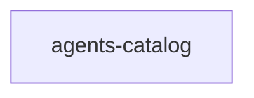

## When to Read
- editing or refactoring `agents-catalog.ts`

## Overview
- `src/agents-catalog.ts` (350 lines · 4 exports) — Curated index of agency-agents (https://github.com/msitarzewski/agency-agents).

## Graph


## Signatures

```typescript
// ── src/agents-catalog.ts ──
/**
 * Curated index of agency-agents (https://github.com/msitarzewski/agency-agents).
 *
 * Each entry describes:
 *   - where the .md file lives in the upstream repo
 *   - what project signals trigger a match
 *   - a short description for the generated README
 */
export interface AgentEntry { /** Slug used as filename: <slug>.md */ slug: string; /** Human-readable name */ name: string; /** One-line description of what this agent does */ description: string; /** How / when to use it (shown in READ…
export interface AgentMatchRule { /** File extensions present in the project (e.g. ['.ts', '.tsx']) */ extensions?: string[]; /** File/dir names that indicate relevance (e.g. ['Dockerfile', 'docker-compose']) */ filePatterns?: RegExp[]; …
export const AGENTS_CATALOG: AgentEntry[] = [ // ── Engineering ─────────────────────────────────────────────────────────── { slug: 'frontend-developer', name: 'Frontend Developer', description: 'React/Vue/Angular, UI implementation, per…
/** Maximum agents to recommend by default */
export const MAX_RECOMMENDED_AGENTS = 10;

```

## Dependencies
- No dependencies detected

## Error Handling
- No explicit throws detected

## Danger Zone 🔴
- No env vars or side effects detected