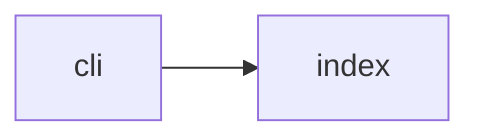

## When to Read
- editing or refactoring `cli.ts`

## Overview
- `src/cli.ts` (6 lines) — CLI entry — command implementations live under `./cli/`.

## Graph


## Signatures

```typescript
(no exports — see ## Source for full script)
```

## Source

### `src/cli.ts`

```typescript
#!/usr/bin/env node
/**
 * CLI entry — command implementations live under `./cli/`.
 */
import './cli/index';

```

## Dependencies
**Internal:**
- `src/cli/index`
