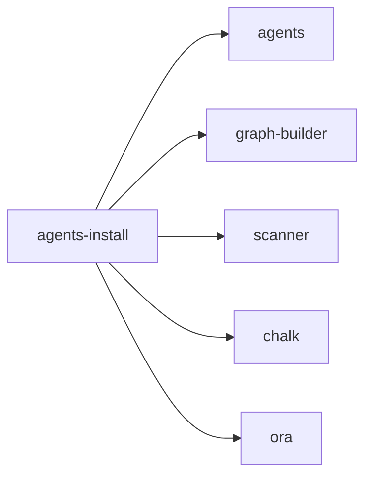

## When to Read
- editing or refactoring `agents-install.ts`

## Overview
- `src/cli/agents-install.ts` (40 lines · 1 top-level symbols) — Mirror — `src/cli/agents-install.ts`

## Graph


## Signatures

```typescript
// ── src/cli/agents-install.ts ──
export async function installRecommendedAgents( scan: ScanResult, plan: BuildPlan | null | undefined, projectRoot: string, opts: { /* ~33 lines */ }

```

## Dependencies
**Internal:**
- `src/agents`
- `src/graph-builder`
- `src/scanner`

**External:**
- `chalk`
- `ora`
