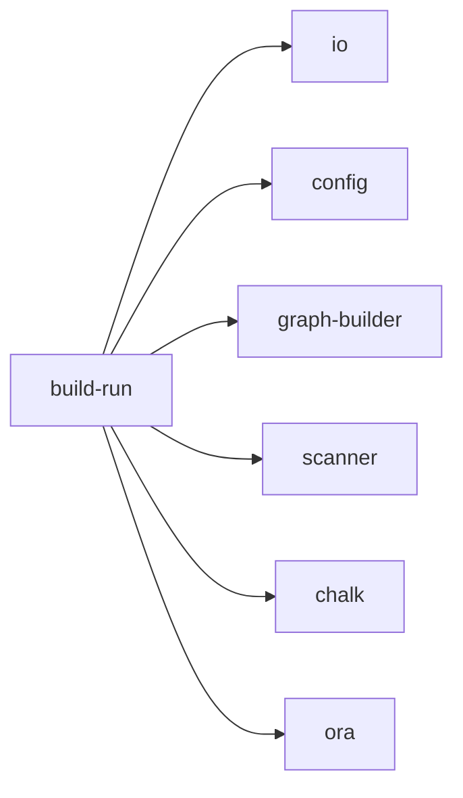

## When to Read
- editing or refactoring `build-run.ts`

## Overview
- `src/cli/build-run.ts` (132 lines · 3 top-level symbols) — Mirror — `src/cli/build-run.ts`

## Graph


## Signatures

```typescript
// ── src/cli/build-run.ts ──
export function resolveBuildStrategy( config: Config, opts: { /* ~22 lines */ }
export interface RunGraphBuildOpts { strategy: BuildStrategy; effectiveHybridMax: number; quiet: boolean; jsonOutput: boolean; getSpinner: () => Ora | null; setSpinner: (spinner: Ora | null) => void; }
export async function runGraphBuild( scan: ScanResult, config: Config, opts: RunGraphBuildOpts ): Promise<MultiPassResult> { /* ~84 lines */ }

```

## Dependencies
**Internal:**
- `src/cli/io`
- `src/config`
- `src/graph-builder`
- `src/scanner`

**External:**
- `chalk`
- `ora`
