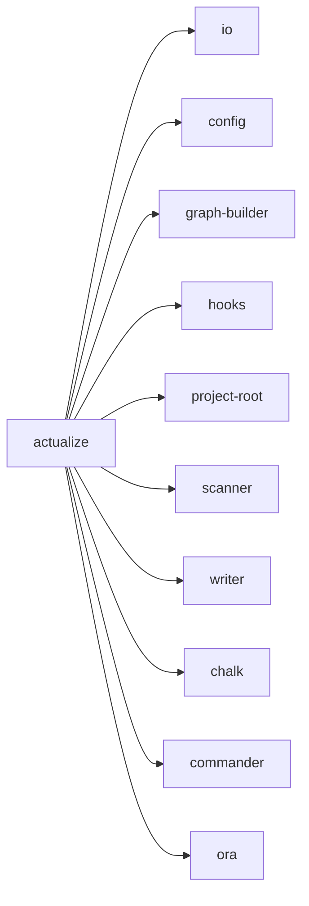

## When to Read
- editing or refactoring `actualize.ts`

## Overview
- `src/cli/commands/actualize.ts` (116 lines · 1 top-level symbols) — Mirror — `src/cli/commands/actualize.ts`

## Graph


## Signatures

```typescript
// ── src/cli/commands/actualize.ts ──
export function registerActualizeCommand(program: Command): void { /* ~102 lines */ }


// CLI commands:
//   actualize
```

## Dependencies
**Internal:**
- `src/cli/io`
- `src/config`
- `src/graph-builder`
- `src/hooks`
- `src/project-root`
- `src/scanner`
- `src/writer`

**External:**
- `chalk`
- `commander`
- `ora`

## Danger Zone 🔴
- **[fs]** filesystem I/O
