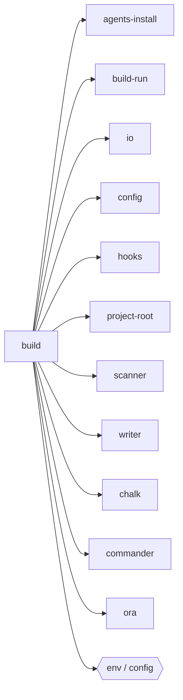

## When to Read
- editing or refactoring `build.ts`

## Overview
- `src/cli/commands/build.ts` (309 lines · 1 top-level symbols) — Mirror — `src/cli/commands/build.ts`

## Graph


## Signatures

```typescript
// ── src/cli/commands/build.ts ──
export function registerBuildCommand(program: Command): void { /* ~279 lines */ }


// CLI commands:
//   build
```

## Dependencies
**Internal:**
- `src/cli/agents-install`
- `src/cli/build-run`
- `src/cli/io`
- `src/config`
- `src/hooks`
- `src/project-root`
- `src/scanner`
- `src/writer`

**External:**
- `chalk`
- `commander`
- `ora`

## Danger Zone 🔴
- **[env]** reads `process.env.CONTEXT_GRAPH_PROVIDER`
- **[env]** reads `process.env.CONTEXT_GRAPH_MODEL`
- **[fs]** filesystem I/O
