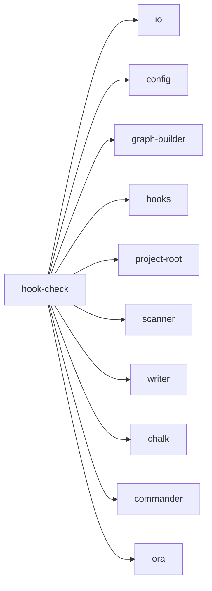

## When to Read
- editing or refactoring `hook-check.ts`

## Overview
- `src/cli/commands/hook-check.ts` (82 lines · 1 top-level symbols) — Mirror — `src/cli/commands/hook-check.ts`

## Graph


## Signatures

```typescript
// ── src/cli/commands/hook-check.ts ──
export function registerHookCheckCommand(program: Command): void { /* ~69 lines */ }


// CLI commands:
//   hook-check
```

## Dependencies
**Internal:**
- `src/cli/io`
- `src/config`
- `src/graph-builder`
- `src/hooks`
- `src/project-root`
- `src/scanner`
- `src/writer`

**External:**
- `chalk`
- `commander`
- `ora`
