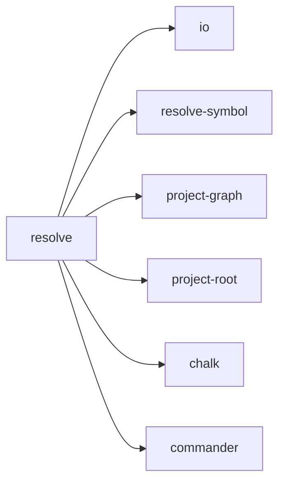

## When to Read
- editing or refactoring `resolve.ts`

## Overview
- `src/cli/commands/resolve.ts` (46 lines · 1 top-level symbols) — Mirror — `src/cli/commands/resolve.ts`

## Graph


## Signatures

```typescript
// ── src/cli/commands/resolve.ts ──
export function registerResolveCommand(program: Command): void { /* ~38 lines */ }


// CLI commands:
//   resolve
```

## Dependencies
**Internal:**
- `src/cli/io`
- `src/graph-builder/resolve-symbol`
- `src/project-graph`
- `src/project-root`

**External:**
- `chalk`
- `commander`
