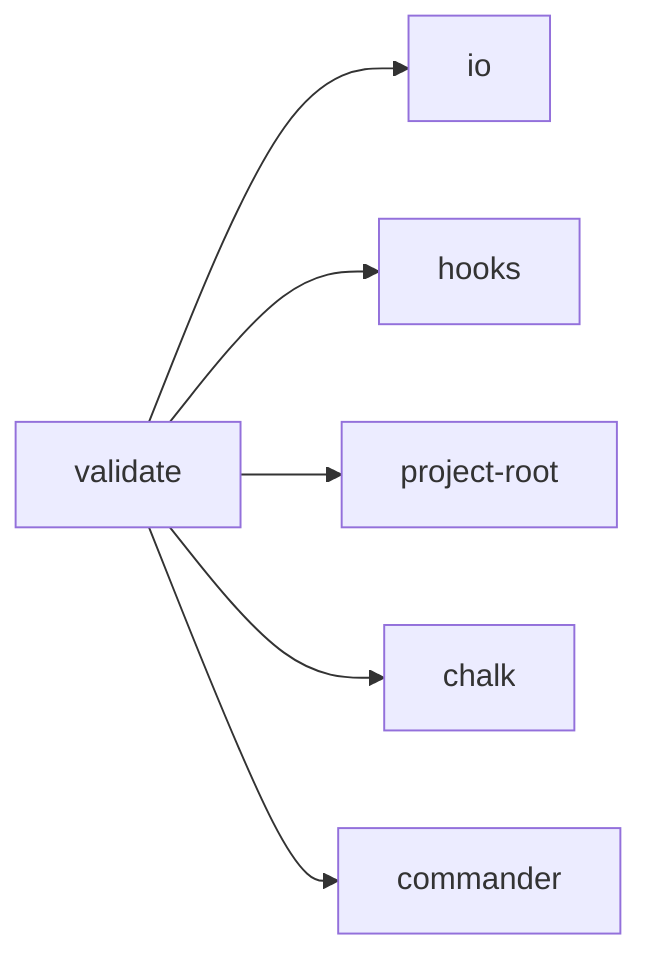

## When to Read
- editing or refactoring `validate.ts`

## Overview
- `src/cli/commands/validate.ts` (52 lines · 1 top-level symbols) — Mirror — `src/cli/commands/validate.ts`

## Graph


## Signatures

```typescript
// ── src/cli/commands/validate.ts ──
export function registerValidateCommand(program: Command): void { /* ~43 lines */ }


// CLI commands:
//   validate
```

## Dependencies
**Internal:**
- `src/cli/io`
- `src/hooks`
- `src/project-root`

**External:**
- `chalk`
- `commander`

## Danger Zone 🔴
- **[fs]** filesystem I/O
