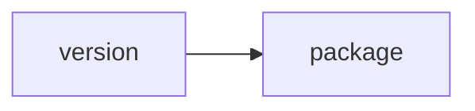

## When to Read
- editing or refactoring `version.ts`

## Overview
- `src/cli/version.ts` (3 lines · 1 top-level symbols) — Mirror — `src/cli/version.ts`

## Graph


## Signatures

```typescript
// ── src/cli/version.ts ──
export const PKG_VERSION: string = (require('../../package.json') as { version: string }).version;

```

## Dependencies
**External:**
- `package`
