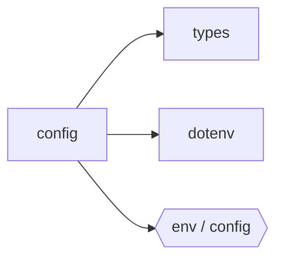

## When to Read
- editing or refactoring `config.ts`

## Overview
- `src/config.ts` (335 lines · 12 top-level symbols) — `slim` = smaller prompts for local LLMs (truncated bodies + shorter root pass).

## Graph


## Signatures

```typescript
// ── src/config.ts ──
/** `slim` = smaller prompts for local LLMs (truncated bodies + shorter root pass). */
export type ContextDepth = 'full' | 'slim';
export type BuildStrategy = 'llm' | 'hybrid' | 'deterministic';
export type OutputStyle = 'normal' | 'compact';
/** How gap-filled / deterministic subsystems group source files (see repairBuildPlan). */
export type SubsystemGrouping = 'default' | 'by-folder';
/** Where instruction files live under `.github/instructions/`: mirror repo paths vs legacy core/infra. */
export type SubsystemLayout = 'mirror' | 'canonical';
export interface Config { /* prompt template (~25 lines) */ }
export const MODEL_MAX_OUTPUT_TOKENS: Record<string, number> = { /* ~24 lines */ }
export function getModelMaxTokens(model: string): number { // Exact match first, then prefix match (e.g. 'gpt-4o-2024-11-20' → 'gpt-4o') if (MODEL_MAX_OUTPUT_TOKENS[model]) return MODEL_MAX_OUTPUT_TOKENS[model]; for (const key of Object.…
/** Ollama does not use a real API key (see `openai.ts` placeholder). */
export function providerAllowsMissingApiKey(provider: ProviderConfig['provider']): boolean { return provider === 'ollama'; }
export function loadConfig(projectRoot: string): Config { /* ~118 lines */ }
export function initConfig( projectRoot: string, providerName?: string, model?: string ): boolean { /* ~24 lines */ }
export async function initConfigInteractive(projectRoot: string): Promise<boolean> { /* ~56 lines */ }

```

## Dependencies
**Internal:**
- `src/providers/types`

**External:**
- `dotenv`

## Error Handling
- `Error`: "Invalid .context-graph.json: ${(e as Error).message}" (`config.ts`)

## Danger Zone 🔴
- **[env]** reads `process.env.CONTEXT_GRAPH_PROVIDER`
- **[env]** reads `process.env.CONTEXT_GRAPH_BASE_URL`
- **[env]** reads `process.env.CONTEXT_GRAPH_CONTEXT_DEPTH`
- **[env]** reads `process.env.CONTEXT_GRAPH_BUILD_STRATEGY`
- **[env]** reads `process.env.CONTEXT_GRAPH_HYBRID_MAX_SUBSYSTEMS`
- **[env]** reads `process.env.CONTEXT_GRAPH_HYBRID_NOTES_MODE`
- **[env]** reads `process.env.CONTEXT_GRAPH_OUTPUT_STYLE`
- **[env]** reads `process.env.CONTEXT_GRAPH_SUBSYSTEM_GROUPING`
- **[env]** reads `process.env.CONTEXT_GRAPH_MAX_FILES_PER_FOLDER_SUBSYSTEM`
- **[env]** reads `process.env.CONTEXT_GRAPH_SUBSYSTEM_LAYOUT`
- **[env]** reads `process.env.CONTEXT_GRAPH_MODEL`
- **[env]** reads `process.env.CONTEXT_GRAPH_MAX_OUTPUT_TOKENS`
- **[env]** reads `process.env.CONTEXT_GRAPH_MAX_FILES`
- **[env]** reads `process.env.CONTEXT_GRAPH_MAX_INPUT_TOKENS`
- **[fs]** filesystem I/O
