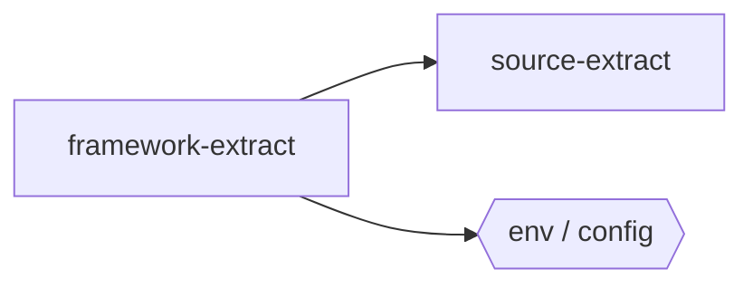

## When to Read
- editing or refactoring `framework-extract.ts`

## Overview
- `src/framework-extract.ts` (749 lines · 10 top-level symbols) — Framework-aware deterministic extraction (no LLM).

## Graph


## Signatures

```typescript
// ── src/framework-extract.ts ──
export { extractCSharpSymbolLines } from './source-extract'
export type FrameworkId = | 'nuxt' | 'vue' | 'react' | 'next' | 'angular' | 'python' | 'php' | 'csharp' | 'rust' | 'java' | 'kotlin' | 'ruby';
/** Detect stacks present in a file (path + content). */
export function detectFrameworks(relPath: string, content: string): FrameworkId[] { /* ~44 lines */ }
export function extractRuntimeSection( relPath: string, content: string ): { /* ~49 lines */ }
export function extractDeterministicErrorsForFile( relPath: string, content: string, fileLabel?: string ): string[] { /* ~29 lines */ }
export function extractSideEffectsForFile(relPath: string, content: string): string[] { /* ~26 lines */ }
/** Extra split-score boosts per detected stack. */
export function frameworkSplitScoreBoost(relPath: string, content: string): number { /* ~45 lines */ }
/** Import buckets for Dependencies section. */
export function classifyFrameworkImports(deps: string[]): { /* ~25 lines */ }
/** Split score including all framework heuristics. */
export function instructionSplitScoreFull(relPath: string, content: string, lines?: number): number { return instructionSplitScore(relPath, content, lines) + frameworkSplitScoreBoost(relPath, content); }
export function needsOwnInstructionFile(relPath: string, content: string, lines?: number): boolean { const norm = relPath.replace(/\\/g, '/'); const top = norm.split('/')[0]; if (['src', 'lib', 'app', 'cmd', 'internal'].includes(top)) re…

```

## Dependencies
**Internal:**
- `src/source-extract`

## Danger Zone 🔴
- **[env]** getenv('${m[1]}')
- **[env]** env('${m[1]}')
