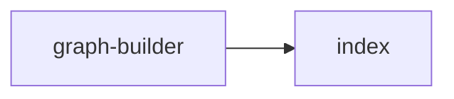

## When to Read
- editing or refactoring `graph-builder.ts`

## Overview
- `src/graph-builder.ts` (6 lines · 1 top-level symbols) — Re-exports preserve backward compatibility for `import … from './graph-builder'`.

## Graph


## Signatures

```typescript
// ── src/graph-builder.ts ──
/**
 * @deprecated Import from `./graph-builder/` modules or `./graph-builder/index` instead.
 * Re-exports preserve backward compatibility for `import … from './graph-builder'`.
 */
export * from './graph-builder/index'

```

## Dependencies
**Internal:**
- `src/graph-builder`
- `src/graph-builder/index`
