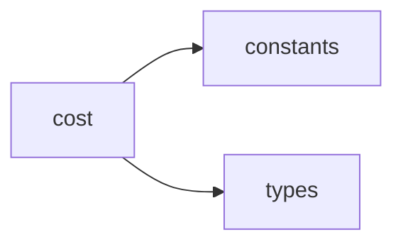

## When to Read
- editing or refactoring `cost.ts`

## Overview
- `src/graph-builder/cost.ts` (14 lines · 1 top-level symbols) — Mirror — `src/graph-builder/cost.ts`

## Graph


## Signatures

```typescript
// ── src/graph-builder/cost.ts ──
export function estimateCost(model: string, usage: LLMUsage): number | null { const pricing = PRICING[model]; if (!pricing) { const key = Object.keys(PRICING).find(k => model.startsWith(k)); if (!key) return null; const p = PRICING[key];…

```

## Dependencies
**Internal:**
- `src/graph-builder/constants`
- `src/providers/types`
