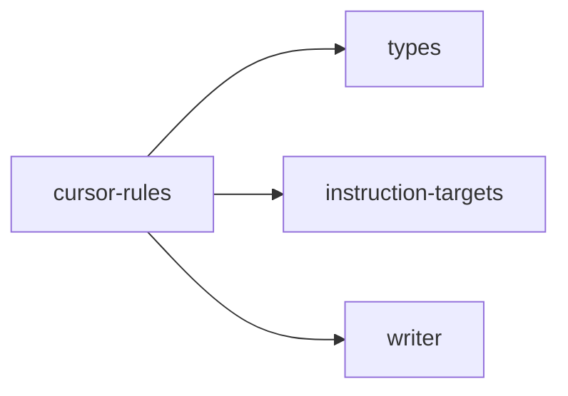

## When to Read
- editing or refactoring `cursor-rules.ts`

## Overview
- `src/graph-builder/deterministic/cursor-rules.ts` (146 lines · 5 top-level symbols) — Mirror — `src/graph-builder/deterministic/cursor-rules.ts`

## Graph


## Signatures

```typescript
// ── src/graph-builder/deterministic/cursor-rules.ts ──
/** Strip YAML frontmatter from subsystem instruction markdown. */
export function stripInstructionFrontmatter(md: string): string { if (!md.startsWith('---')) return md.trim(); const end = md.indexOf('\n---', 3); if (end === -1) return md.trim(); const after = md.indexOf('\n', end + 4); return (after =…
/** `applyTo` from plan → Cursor `globs` string (comma-separated). */
export function applyToToCursorGlobs(applyTo: string): string { const parts = applyTo .split(',') .map(s => s.trim()) .filter(Boolean); if (parts.length === 0) return '**/*'; return parts .map(p => p.replace(/\\/g, '/')) .join(', '); }
export function slugFromInstructionFile(instructionRel: string): string { const base = instructionRel.replace(/\.instructions\.md$/i, ''); const slug = base.replace(/[^a-zA-Z0-9]+/g, '-').replace(/^-+|-+$/g, ''); const name = `${RULE_PRE…
export function buildCursorRuleMdc( planItem: BuildPlanItem, instructionRelPath: string, instructionBody: string ): string { /* prompt template (~24 lines) */ }
/**
 * Emit one \`.cursor/rules/ctxgraph--<slug>.mdc\` per subsystem so Cursor auto-loads
 * instructions without asking the model to open files manually.
 */
export function appendCursorRuleFiles( plan: BuildPlan, files: OutputFile[], instructionTargets: InstructionTargetId[] = [] ): void { /* prompt template (~48 lines) */ }

```

## Dependencies
**Internal:**
- `src/graph-builder/types`
- `src/instruction-targets`
- `src/writer`
