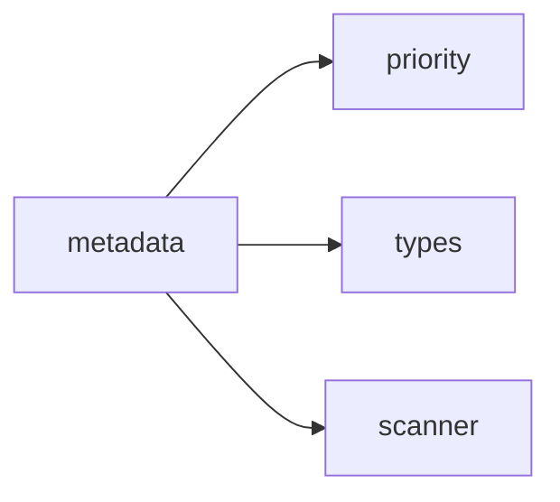

## When to Read
- editing or refactoring `metadata.ts`

## Overview
- `src/graph-builder/deterministic/metadata.ts` (136 lines · 4 top-level symbols) — Mirror — `src/graph-builder/deterministic/metadata.ts`

## Graph


## Signatures

```typescript
// ── src/graph-builder/deterministic/metadata.ts ──
export interface MetadataProjectSettings { buildStrategy?: string; instructionTargets?: string[]; installAgents?: boolean; }
export function buildMetadataJson( today: string, scan: ScanResult, plan?: BuildPlan, projectSettings?: MetadataProjectSettings ): string { /* ~58 lines */ }
/** Flat table: every instruction path ↔ applyTo ↔ sources (for LLMs and search). */
export function buildContextGraphPathIndexMd(today: string, plan: BuildPlan): string { /* prompt template (~20 lines) */ }
/** Build index.md content from plan subsystems — no LLM guessing */
export function buildIndexMd(today: string, plan?: BuildPlan): string { /* prompt template (~43 lines) */ }

```

## Dependencies
**Internal:**
- `src/graph-builder/plan/priority`
- `src/graph-builder/types`
- `src/scanner`
