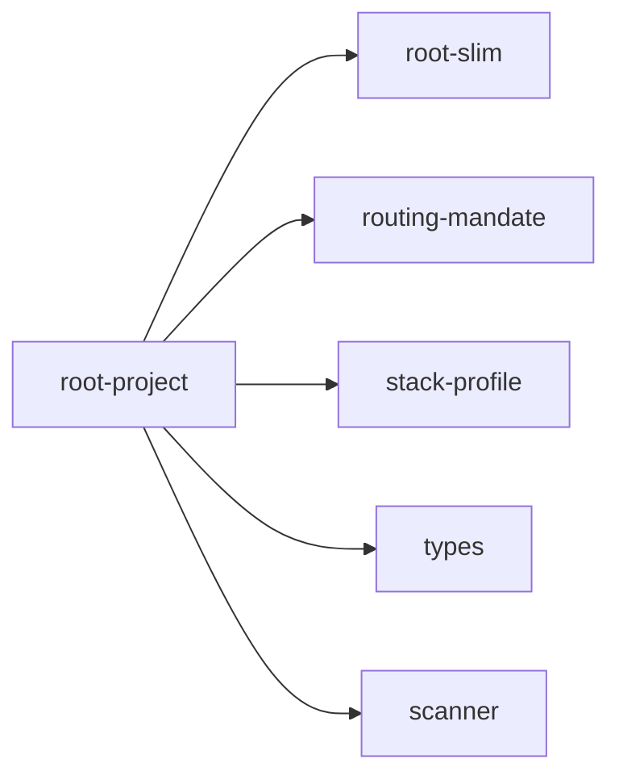

## When to Read
- editing or refactoring `root-project.ts`

## Overview
- `src/graph-builder/deterministic/root-project.ts` (267 lines · 6 top-level symbols) — Mirror — `src/graph-builder/deterministic/root-project.ts`

## Graph


## Signatures

```typescript
// ── src/graph-builder/deterministic/root-project.ts ──
export function buildHowToUseGraphSection( plan: BuildPlan, profile: ProjectStackProfile ): string[] { /* prompt template (~28 lines) */ }
export function buildCodeZonesSection(plan: BuildPlan, profile: ProjectStackProfile): string[] { /* prompt template (~53 lines) */ }
export function buildProjectDataFlowSection( scan: ScanResult, profile: ProjectStackProfile ): string[] { /* prompt template (~62 lines) */ }
export interface NavZonePick { zone: string; subsystem: BuildPlanItem; }
/** Zone-aware highlights for slim root (Laravel API first, not random P0 Vue). */
export function pickZoneNavigationHighlights( plan: BuildPlan, profile: ProjectStackProfile, maxTotal: number ): string[] { /* prompt template (~63 lines) */ }
export function getProjectStackProfile(scan: ScanResult): ProjectStackProfile { return detectProjectStackProfile(scan); }

```

## Dependencies
**Internal:**
- `src/graph-builder/deterministic/root-slim`
- `src/graph-builder/deterministic/routing-mandate`
- `src/graph-builder/plan/stack-profile`
- `src/graph-builder/types`
- `src/scanner`
