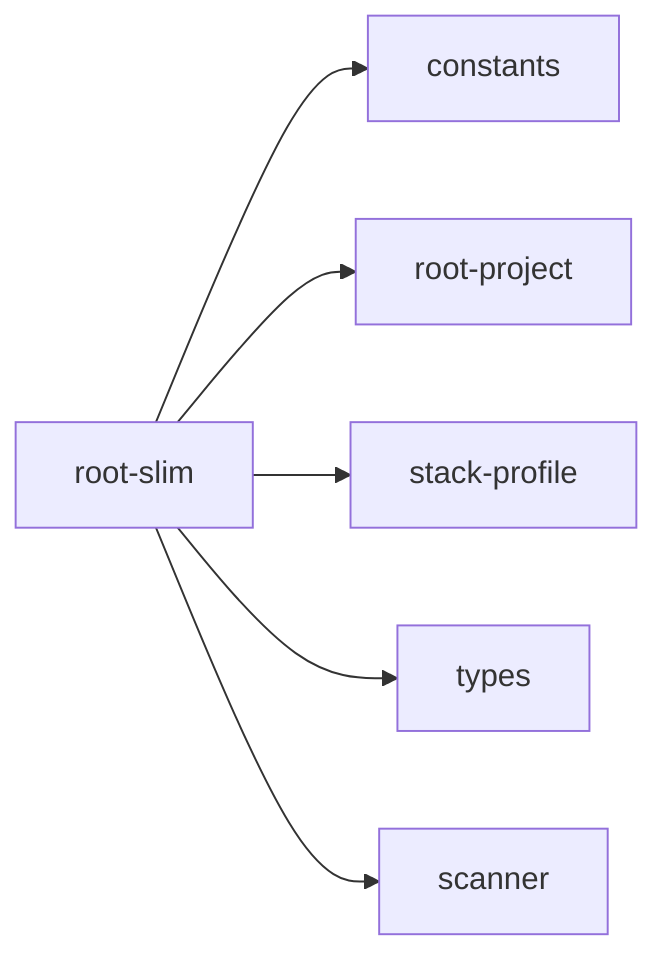

## When to Read
- editing or refactoring `root-slim.ts`

## Overview
- `src/graph-builder/deterministic/root-slim.ts` (196 lines · 7 top-level symbols) — Mirror — `src/graph-builder/deterministic/root-slim.ts`

## Graph


## Signatures

```typescript
// ── src/graph-builder/deterministic/root-slim.ts ──
export interface CopilotRootOptions { /** Force slim root (e.g. `contextDepth: slim`). Auto when subsystems ≥ threshold. */ slimRoot?: boolean; }
export function resolveRootSlimMode(plan: BuildPlan, opts?: CopilotRootOptions): boolean { if (opts?.slimRoot === true) return true; if (opts?.slimRoot === false) return false; if (plan.subsystems.length >= ROOT_SLIM_AUTO_SUBSYSTEM_THRES…
/** Directory key for grouping (up to 3 segments under repo root). */
export function sourceDirGroupKey(sourcePath: string): string { const norm = sourcePath.replace(/\\/g, '/'); if (!norm.includes('/')) return '.'; const parts = path.posix.dirname(norm).split('/').filter(Boolean); const depth = parts[0] =…
export interface DirGroupSummary { dir: string; subsystemCount: number; sourceFileCount: number; bestPriority: BuildPlanItem['priority']; }
export function summarizeSubsystemDirGroups(plan: BuildPlan): DirGroupSummary[] { /* ~26 lines */ }
export function buildQuickNavigationLines( plan: BuildPlan, slim: boolean, scan?: ScanResult ): string[] { /* prompt template (~92 lines) */ }
export function buildSlimArchitectureOverviewLines(plan: BuildPlan): string[] { /* prompt template (~24 lines) */ }

```

## Dependencies
**Internal:**
- `src/graph-builder/constants`
- `src/graph-builder/deterministic/root-project`
- `src/graph-builder/plan/stack-profile`
- `src/graph-builder/types`
- `src/scanner`
