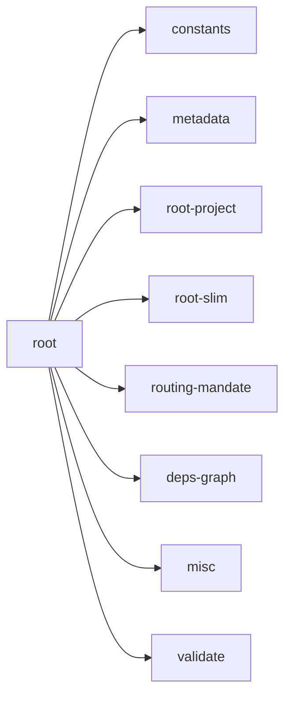

## When to Read
- editing or refactoring `root.ts`

## Overview
- `src/graph-builder/deterministic/root.ts` (384 lines · 5 top-level symbols) — Mirror — `src/graph-builder/deterministic/root.ts`

## Graph


## Signatures

```typescript
// ── src/graph-builder/deterministic/root.ts ──
export type { CopilotRootOptions }
export function buildDeterministicCopilotInstructions( today: string, scan: ScanResult, plan: BuildPlan, rootOpts?: CopilotRootOptions ): string { /* prompt template (~142 lines) */ }
export function buildDeterministicChangelog(today: string, plan: BuildPlan): string { const lines = [ `# Context Graph — Changelog`, ``, `## ${today} — Initial Build`, ``, `Subsystems created:`, ...plan.subsystems.map(s => `- \`${s.file}…
/** Standard scan-exclusion hints — never infer top-level dirs from nested lockfiles. */
export function buildDeterministicCopilotIgnore(_scan?: ScanResult): string { return [ '# Managed by context-graph — scan exclusions (gitignore syntax; ** = any depth)', '# For project-specific paths use .graph-context-ignore (does not o…
export function injectDeterministicRootFiles( today: string, scan: ScanResult, plan: BuildPlan, files: OutputFile[], llmCopilotContent?: string, rootOpts?: CopilotRootOptions, instructionTargets: I… { /* prompt template (~164 lines) */ }

```

## Dependencies
**Internal:**
- `src/graph-builder/constants`
- `src/graph-builder/deterministic/metadata`
- `src/graph-builder/deterministic/root-project`
- `src/graph-builder/deterministic/root-slim`
- `src/graph-builder/deterministic/routing-mandate`
- `src/graph-builder/extract/deps-graph`
- `src/graph-builder/extract/misc`
- `src/graph-builder/llm/validate`
- `src/graph-builder/prompt`
- `src/graph-builder/resolve-symbol`
- `src/graph-builder/types`
- `src/instruction-targets`
- `… +2 more (open repo for full list)`
