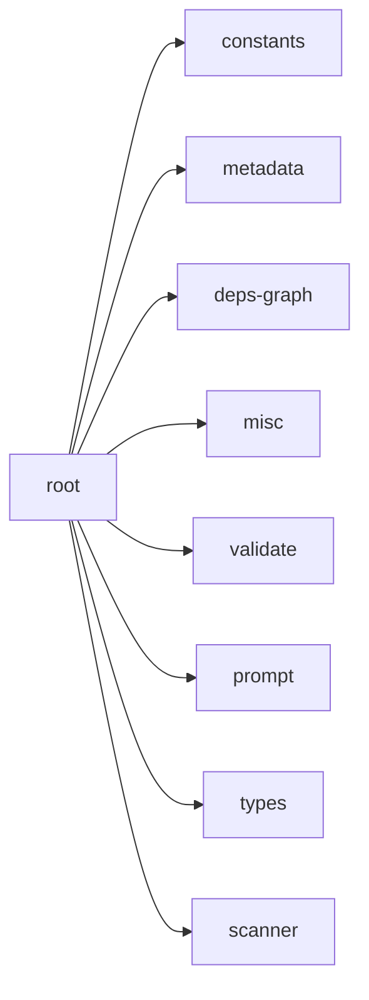

## When to Read
- editing or refactoring `root.ts`

## Overview
- `src/graph-builder/deterministic/root.ts` (359 lines · 4 top-level symbols) — Mirror — `src/graph-builder/deterministic/root.ts`

## Graph


## Signatures

```typescript
// ── src/graph-builder/deterministic/root.ts ──
export function buildDeterministicCopilotInstructions( today: string, scan: ScanResult, plan: BuildPlan ): string { /* prompt template (~172 lines) */ }
export function buildDeterministicChangelog(today: string, plan: BuildPlan): string { const lines = [ `# Context Graph — Changelog`, ``, `## ${today} — Initial Build`, ``, `Subsystems created:`, ...plan.subsystems.map(s => `- \`${s.file}…
export function buildDeterministicCopilotIgnore(scan: ScanResult): string { /* ~31 lines */ }
export function injectDeterministicRootFiles( today: string, scan: ScanResult, plan: BuildPlan, files: OutputFile[], llmCopilotContent?: string ): void { /* prompt template (~123 lines) */ }

```

## Dependencies
**Internal:**
- `src/graph-builder/constants`
- `src/graph-builder/deterministic/metadata`
- `src/graph-builder/extract/deps-graph`
- `src/graph-builder/extract/misc`
- `src/graph-builder/llm/validate`
- `src/graph-builder/prompt`
- `src/graph-builder/types`
- `src/scanner`
- `src/writer`
