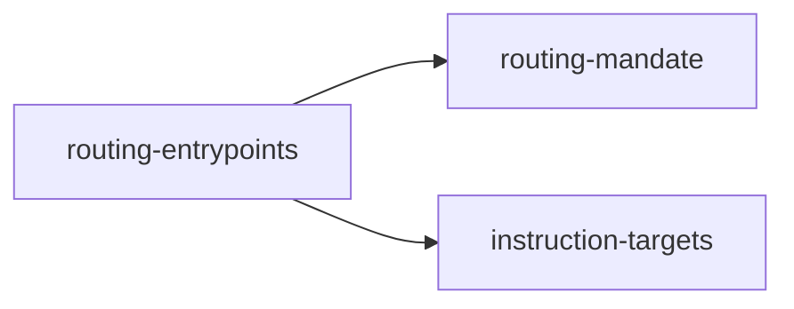

## When to Read
- editing or refactoring `routing-entrypoints.ts`

## Overview
- `src/graph-builder/deterministic/routing-entrypoints.ts` (77 lines · 7 top-level symbols) — Mirror — `src/graph-builder/deterministic/routing-entrypoints.ts`

## Graph


## Signatures

```typescript
// ── src/graph-builder/deterministic/routing-entrypoints.ts ──
/** Minimum markers every full routing entry file must contain. */
export const ROUTING_MANDATE_MARKERS = [ ROUTING_MANDATE_HEADING, 'symbol-index', 'FORBIDDEN', ] as const;
/** Paths checked when the corresponding instruction target is enabled. */
export const ROUTING_ENTRYPOINTS_BY_TARGET: Record<InstructionTargetId, readonly string[]> = { copilot: ['.github/copilot-instructions.md'], cursor: ['.cursor/rules/context-graph.mdc'], claude: ['CLAUDE.md'], agents: [], gemini: ['GEMINI…
/** Always emitted with the instruction graph (any agent should read). */
export const ROUTING_CORE_ENTRYPOINTS = [ '.github/instructions/copilot-instructions.md', 'AGENTS.md', ] as const;
export interface RoutingEntrypointIssue { relPath: string; kind: 'missing' | 'weak'; detail?: string; }
export function routingContentHasMandate(content: string): boolean { return ROUTING_MANDATE_MARKERS.every(m => content.includes(m)); }
export function collectExpectedRoutingEntrypoints( instructionTargets: InstructionTargetId[] ): string[] { const out = new Set<string>(ROUTING_CORE_ENTRYPOINTS); const targets = instructionTargets.length > 0 ? instructionTargets : (Objec…
export function auditRoutingEntrypoints( projectRoot: string, instructionTargets: InstructionTargetId[] ): RoutingEntrypointIssue[] { /* ~22 lines */ }

```

## Dependencies
**Internal:**
- `src/graph-builder/deterministic/routing-mandate`
- `src/instruction-targets`

## Danger Zone 🔴
- **[fs]** filesystem I/O
