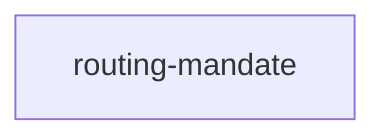

## When to Read
- editing or refactoring `routing-mandate.ts`

## Overview
- `src/graph-builder/deterministic/routing-mandate.ts` (272 lines · 14 top-level symbols) — Imperative routing copy (MUST / BLOCKING) — no "when", "should", "prefer".

## Graph


## Signatures

```typescript
// ── src/graph-builder/deterministic/routing-mandate.ts ──
/** Imperative routing copy (MUST / BLOCKING) — no "when", "should", "prefer". */
export const ROUTING_MANDATE_HEADING = '## MANDATORY — read instructions first (BLOCKING)';
/** When user names a component/file in chat (LinkTag, useSeo) — no file open. */
export function buildNamedEntityRoutingMandate(): string[] { /* prompt template (~16 lines) */ }
/** Shared 5-step BLOCKING workflow. */
export function buildRoutingWorkflowSteps(examplePath?: string): string[] { /* prompt template (~18 lines) */ }
/** After "## How to use this graph" in copilot-instructions.md */
export function buildCopilotGraphMandate(examplePath: string): string[] { return [ ROUTING_MANDATE_HEADING, ``, ...buildNamedEntityRoutingMandate(), ...buildRoutingWorkflowSteps(examplePath), `**GitHub Copilot (VS Code / JetBrains / Copi…
/** Top of CLAUDE.md / AGENTS.md / GEMINI.md — immediately after title. */
export function buildAgentEntryMandate(): string[] { return [ ROUTING_MANDATE_HEADING, ``, ...buildNamedEntityRoutingMandate(), ...buildRoutingWorkflowSteps(), ]; }
export type AgentEntryTool = | 'claude' | 'agents' | 'gemini' | 'codex' | 'windsurf' | 'cline' | 'copilot';
/** Tool-specific lines after shared mandate (docs-backed, May 2026). */
export function buildToolSpecificRoutingLines(tool: AgentEntryTool): string[] { /* prompt template (~71 lines) */ }
export function buildAgentEntryWithTool(title: string, tool: AgentEntryTool): string[] { return [ `# ${title}`, ``, ...buildAgentEntryMandate(), ...buildToolSpecificRoutingLines(tool), ]; }
/** Short router blurb (legacy / embedded refs). */
export function buildCursorRouterMandate(): string[] { return [ `## MANDATORY routing (BLOCKING)`, ``, `**MUST** follow attached \`ctxgraph--*\` rule when \`globs\` match the file you edit.`, `If none attached: **MUST** complete path-ind…
/** Cursor \`context-graph.mdc\` body — full BLOCKING mandate (alwaysApply: true). */
export function buildCursorAlwaysOnRuleBody(): string { /* prompt template (~21 lines) */ }
/** Windsurf: always_on trigger (docs.windsurf.com — rules in .windsurf/rules/). */
export function buildWindsurfContextGraphRule(): string { /* ~18 lines */ }
/** Cline workspace rule (no standard always-on frontmatter). */
export function buildClineContextGraphRule(): string { return [ `# context-graph — Cline routing`, ``, ROUTING_MANDATE_HEADING, ``, ...buildNamedEntityRoutingMandate(), ...buildRoutingWorkflowSteps(), ...buildToolSpecificRoutingLines('cl…
/** Codex supplemental doc (AGENTS.md is primary). */
export function buildCodexContextGraphRule(): string { return [ `# context-graph — Codex supplement`, ``, `**MUST** read \`AGENTS.md\` at repo root first — Codex loads it before every run.`, ``, ROUTING_MANDATE_HEADING, ``, ...buildNamed…
/** Compact matrix for copilot-instructions / human reference. */
export function buildAiToolRoutingReferenceSection(): string[] { /* prompt template (~22 lines) */ }

```

## Dependencies
- No dependencies detected
