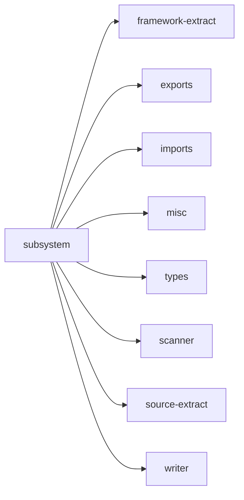

## When to Read
- editing or refactoring `subsystem.ts`

## Overview
- `src/graph-builder/deterministic/subsystem.ts` (298 lines · 1 top-level symbols) — Mirror — `src/graph-builder/deterministic/subsystem.ts`

## Graph


## Signatures

```typescript
// ── src/graph-builder/deterministic/subsystem.ts ──
export function buildDeterministicSubsystemFile( today: string, instructionPath: string, planItem: BuildPlanItem | undefined, scan: ScanResult, sourceFiles: string[] ): OutputFile { /* prompt template (~265 lines) */ }

```

## Dependencies
**Internal:**
- `src/framework-extract`
- `src/graph-builder/extract/exports`
- `src/graph-builder/extract/imports`
- `src/graph-builder/extract/misc`
- `src/graph-builder/types`
- `src/scanner`
- `src/source-extract`
- `src/writer`
