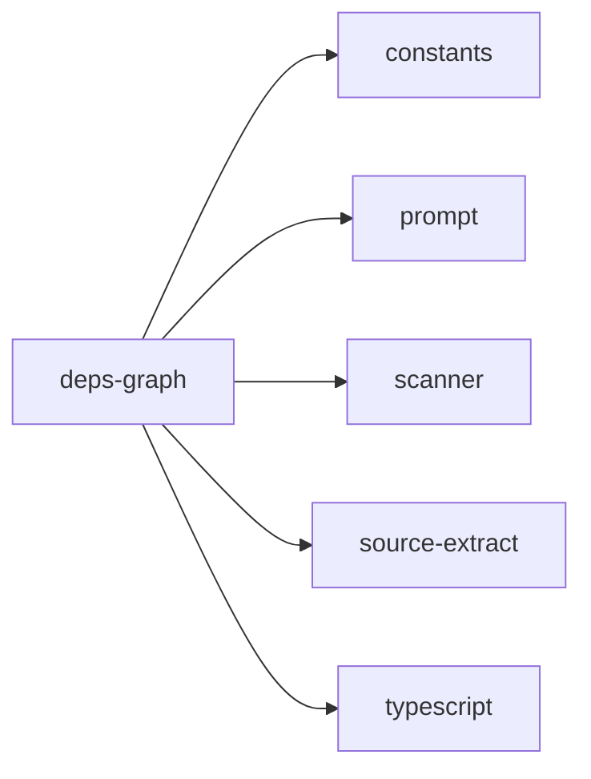

## When to Read
- editing or refactoring `deps-graph.ts`

## Overview
- `src/graph-builder/extract/deps-graph.ts` (209 lines · 6 top-level symbols) — Mirror — `src/graph-builder/extract/deps-graph.ts`

## Graph


## Signatures

```typescript
// ── src/graph-builder/extract/deps-graph.ts ──
export const TS_JS_EXTS = ['.ts', '.tsx', '.js', '.jsx', '.mjs', '.cjs', '.vue', '.go', '.py'];
export function isTsJsLikePath(p: string): boolean { return /\.(ts|tsx|js|jsx|mjs|cjs|vue)$/i.test(p); }
export function stripKnownExt(p: string): string { return p.replace(/\.(ts|tsx|js|jsx|mjs|cjs|vue|go|py)$/i, ''); }
export function extractImportSpecifiersFromTsAst(filePath: string, content: string): string[] { /* ~29 lines */ }
export function resolveInternalImport( fromFile: string, spec: string, existingPaths: Set<string> ): string | null { /* ~30 lines */ }
export function buildDeterministicDependencyGraph( scan: ScanResult, opts?: { /* prompt template (~129 lines) */ }

```

## Dependencies
**Internal:**
- `src/graph-builder/constants`
- `src/graph-builder/prompt`
- `src/scanner`
- `src/source-extract`

**External:**
- `typescript`
