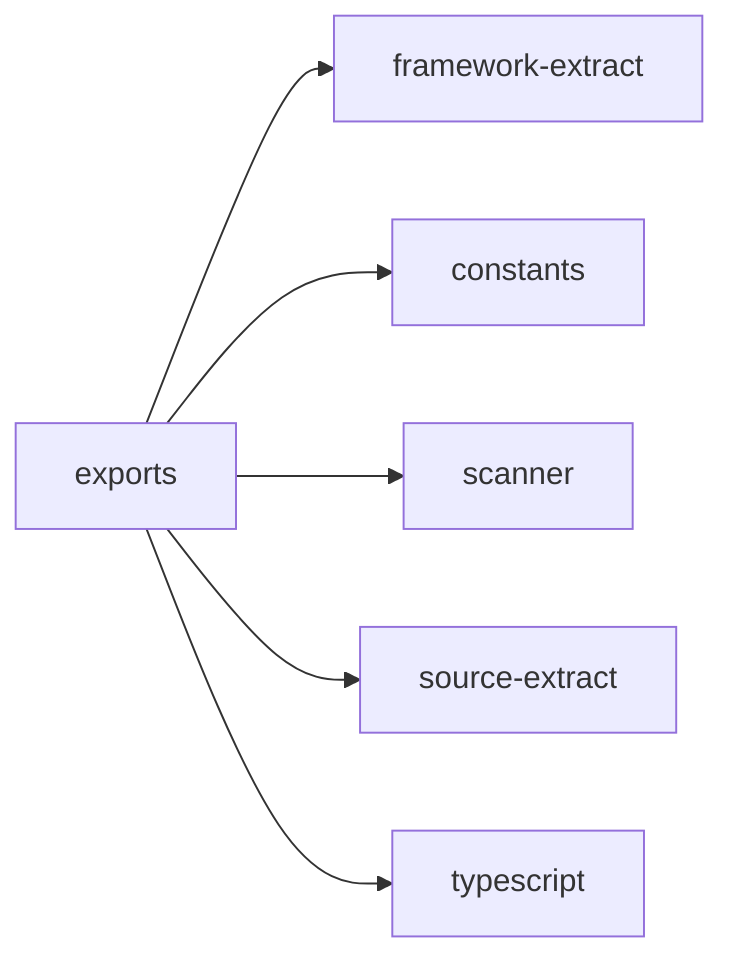

## When to Read
- editing or refactoring `exports.ts`

## Overview
- `src/graph-builder/extract/exports.ts` (436 lines · 7 top-level symbols) — Mirror — `src/graph-builder/extract/exports.ts`

## Graph


## Signatures

```typescript
// ── src/graph-builder/extract/exports.ts ──
/** JSDoc attached to a declaration (leading trivia via TS API). */
export function formatAttachedJSDocBlocks(sf: ts.SourceFile, node: ts.Node): string[] { /* ~16 lines */ }
/**
 * Extract exports with surrounding context: JSDoc comments above the export,
 * and the first meaningful line of the body (to hint at return type / purpose).
 */
export function extractExports(scan: ScanResult, sourceFiles: string[]): string { /* prompt template (~242 lines) */ }
export const DETERMINISTIC_SOURCE_MAX_LINES = 80;
export const DETERMINISTIC_SOURCE_SKELETON_MAX_LINES = 48;
/** Full ## Source only when signatures are thin or UI/runtime needs script body. */
export function shouldIncludeDeterministicSource( scan: ScanResult, sourceFiles: string[], exportBlock: string ): boolean { /* ~21 lines */ }
export function buildDeterministicSourceSection(scan: ScanResult, sourceFiles: string[]): string[] { /* prompt template (~67 lines) */ }
/** Mermaid nodes for Vue SFCs: props, computeds, resolve branches. */
export function buildVueMermaidNodes( filePath: string, content: string, externalNodeIds: Set<string> ): string[] { /* prompt template (~35 lines) */ }

```

## Dependencies
**Internal:**
- `src/framework-extract`
- `src/graph-builder/constants`
- `src/scanner`
- `src/source-extract`

**External:**
- `typescript`
