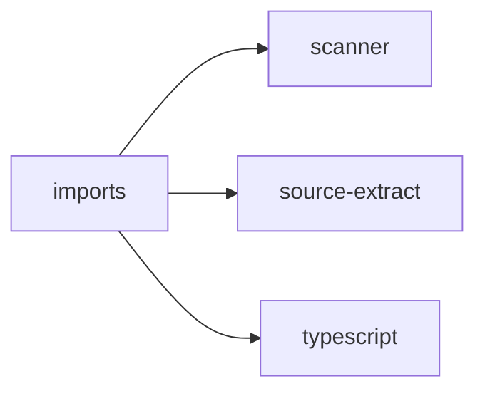

## When to Read
- editing or refactoring `imports.ts`

## Overview
- `src/graph-builder/extract/imports.ts` (129 lines · 2 top-level symbols) — Mirror — `src/graph-builder/extract/imports.ts`

## Graph


## Signatures

```typescript
// ── src/graph-builder/extract/imports.ts ──
export function extractImports(scan: ScanResult, sourceFiles: string[]): string[] { /* ~103 lines */ }
/** Check if a file is a barrel (re-exports only, no own logic). */
export function isBarrelFile(content: string): boolean { const lines = content.split('\n').filter(l => l.trim() && !l.trim().startsWith('//')); if (lines.length === 0) return false; const reExportLines = lines.filter(l => /^export\s+(\{.…

```

## Dependencies
**Internal:**
- `src/scanner`
- `src/source-extract`

**External:**
- `typescript`
