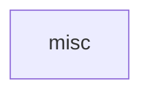

## When to Read
- editing or refactoring `misc.ts`

## Overview
- `src/graph-builder/extract/misc.ts` (103 lines · 5 top-level symbols) — Mirror — `src/graph-builder/extract/misc.ts`

## Graph


## Signatures

```typescript
// ── src/graph-builder/extract/misc.ts ──
export function extractCliCommands(content: string): string[] { const commands: string[] = []; const lines = content.split('\n'); for (const line of lines) { // Commander: .command('build [dir]') const m = line.match(/\.command\(\s*['"](…
/** `export * from` / `export { } from` targets (barrel files). */
export function extractReExportTargets(content: string): string[] { const out: string[] = []; for (const line of content.split('\n')) { const t = line.trim(); const star = t.match(/^export\s+\*\s+from\s+['"]([^'"]+)['"]/); if (star) out.…
/** Reject auto-extracted purpose lines that are code hints, not file intent. */
export function isWeakFilePurpose(purpose: string): boolean { const t = purpose.trim(); if (t.length < 12) return true; return PURPOSE_COMMENT_SKIP.test(t); }
/** Lines before first top-level declaration (file banner only). */
export function fileHeaderSlice(content: string): string { const lines = content.split('\n'); const header: string[] = []; for (const line of lines) { const t = line.trim(); if (!t) { header.push(line); continue; } if ( /^(export\s|impor…
/** One-line purpose summary: JSDoc / file-level `//` / `#` (PHP) — not in-function comments. */
export function extractFilePurpose(content: string): string | null { /* ~45 lines */ }


// CLI commands:
//   build
```

## Dependencies
- No dependencies detected
