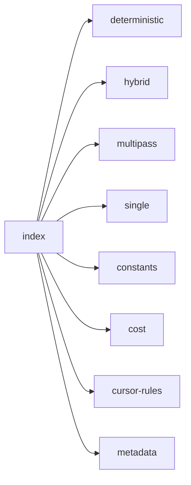

## When to Read
- editing or refactoring `index.ts`

## Overview
- `src/graph-builder/index.ts` (70 lines · 30 top-level symbols) — Graph builder — modular layout (was monolithic graph-builder.ts).

## Graph


## Signatures

```typescript
// ── src/graph-builder/index.ts ──
/**
 * Graph builder — modular layout (was monolithic graph-builder.ts).
 */
export * from './types'
export { /* prompt template (~1 lines) */ }
export { loadSystemPrompt, loadExistingGraph, styleDirective, fileReadsEnvironment } from './prompt'
export { extractExports, buildDeterministicSourceSection, shouldIncludeDeterministicSource, buildVueMermaidNodes, } from './extract/exports'
export { extractImports } from './extract/imports'
export { buildDeterministicDependencyGraph } from './extract/deps-graph'
export { extractCliCommands, extractFilePurpose } from './extract/misc'
export { isBarrelFile } from './extract/imports'
export { parseBuildPlan } from './plan/parse'
export { buildPlanningContextLight, inferDefaultsFromScan } from './plan/infer'
export { partitionInstructionChunks, humanAreaName, } from './plan/layout'
export { repairBuildPlan, repairOptionsFromConfig, resolveRepairOptions, groupPathsIntoAutoSubsystems, } from './plan/repair'
export { detectProjectStackProfile, shouldAutoFolderGrouping } from './plan/stack-profile'
export { inferFilePriority, inferSubsystemPriority, maxPriority } from './plan/priority'
export type { InstructionPriority } from './plan/priority'
export { buildDeterministicCopilotInstructions, buildDeterministicChangelog, buildDeterministicCopilotIgnore, injectDeterministicRootFiles, } from './deterministic/root'
export { appendCursorRuleFiles } from './deterministic/cursor-rules'
export { buildMetadataJson, buildContextGraphPathIndexMd, buildIndexMd, } from './deterministic/metadata'
export { buildDeterministicSubsystemFile } from './deterministic/subsystem'
export { mergeLlmProse, sanitizeMermaidBlocks, subsystemOutputLooksOk, llmContentMatchesRealExports, buildSubsystemRepairMessage, insertAfterHeading, } from './llm/validate'
export { /* prompt template (~8 lines) */ }
export { buildPlanningPassMessage } from './messages/planning'
export { buildRootPassMessage } from './messages/root'
export { /* prompt template (~1 lines) */ }
export { parseSubsystemMappings, findMissingSubsystemPaths } from './discovery'
export { estimateCost } from './cost'
export { buildGraphDeterministic } from './build/deterministic'
export { buildGraph } from './build/single'
export { buildGraphHybrid } from './build/hybrid'
export { buildGraphMultiPass } from './build/multipass'

```

## Dependencies
**Internal:**
- `src/graph-builder/build/deterministic`
- `src/graph-builder/build/hybrid`
- `src/graph-builder/build/multipass`
- `src/graph-builder/build/single`
- `src/graph-builder/constants`
- `src/graph-builder/cost`
- `src/graph-builder/deterministic/cursor-rules`
- `src/graph-builder/deterministic/metadata`
- `src/graph-builder/deterministic/root`
- `src/graph-builder/deterministic/subsystem`
- `src/graph-builder/discovery`
- `src/graph-builder/extract/deps-graph`
- `… +16 more (open repo for full list)`
