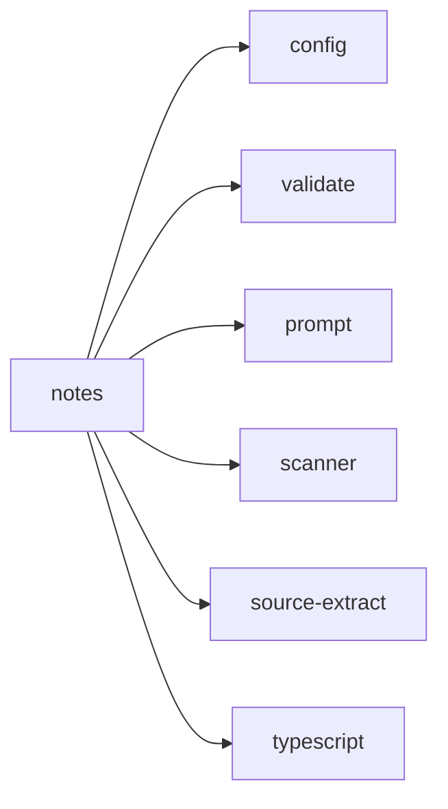

## When to Read
- editing or refactoring `notes.ts`

## Overview
- `src/graph-builder/llm/notes.ts` (263 lines · 6 top-level symbols) — Mirror — `src/graph-builder/llm/notes.ts`

## Graph


## Signatures

```typescript
// ── src/graph-builder/llm/notes.ts ──
export function insertNotesSection(md: string, notes: string, afterHeading: string): string { /* ~14 lines */ }
export function buildNotesPrompt( config: Config, kind: 'root' | 'subsystem', title: string, exportsBlock: string, snippet: string ): string { /* prompt template (~32 lines) */ }
export function buildSnippetForFiles(scan: ScanResult, sourceFiles: string[], maxChars: number): string { /* prompt template (~93 lines) */ }
export function insertExportNotesUnderSignatures(md: string, notes: string): string { if (!notes.trim()) return md; const clean = notes.trim().replace(/\r\n/g, '\n'); const section = `### Notes (LLM)\n\n${clean}\n`; return insertAfterHea…
export function extractExportNamesForNotes(scan: ScanResult, sourceFiles: string[]): string[] { /* ~76 lines */ }
export function buildExportNotesPrompt(config: Config, title: string, exportNames: string[], snippet: string): string { /* prompt template (~23 lines) */ }

```

## Dependencies
**Internal:**
- `src/config`
- `src/graph-builder/llm/validate`
- `src/graph-builder/prompt`
- `src/scanner`
- `src/source-extract`

**External:**
- `typescript`
