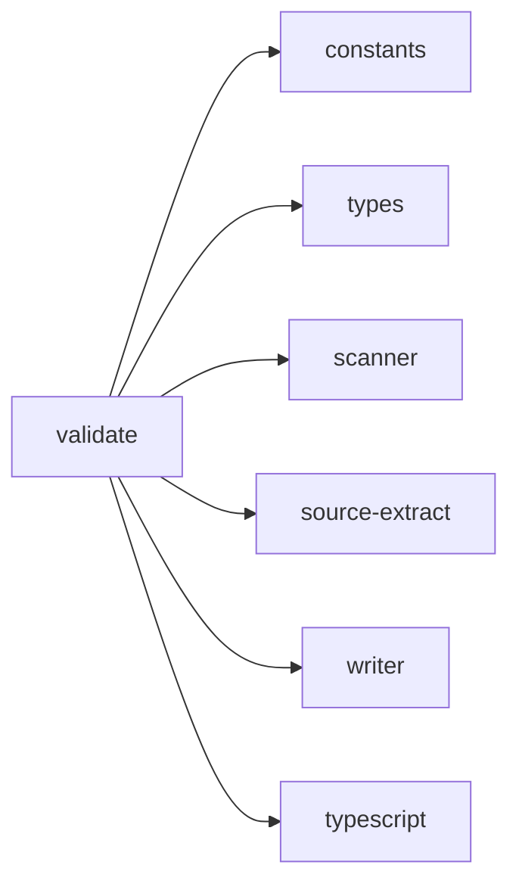

## When to Read
- editing or refactoring `validate.ts`

## Overview
- `src/graph-builder/llm/validate.ts` (203 lines · 6 top-level symbols) — Mirror — `src/graph-builder/llm/validate.ts`

## Graph


## Signatures

```typescript
// ── src/graph-builder/llm/validate.ts ──
export function mergeLlmProse(skeleton: string, llmContent: string): string { /* ~26 lines */ }
export function insertAfterHeading(md: string, heading: string, insert: string): string { const re = new RegExp(`^## ${heading}\\b[^\\n]*\\n`, 'm'); const m = re.exec(md); if (!m) return md + '\n\n' + insert; const insertAt = m.index + m…
export function subsystemOutputLooksOk(files: OutputFile[], instructionPath: string): boolean { const norm = instructionPath.replace(/\\/g, '/'); const base = path.posix.basename(norm); return files.some(f => { const fp = f.path.replace(…
/** Sanitize mermaid code blocks: strip lines with common LLM syntax errors. */
export function sanitizeMermaidBlocks(content: string): string { /* ~22 lines */ }
export function llmContentMatchesRealExports( llmContent: string, scan: ScanResult, sourceFiles: string[] ): boolean { /* ~77 lines */ }
/** Second-chance prompt when local models skip <<<EOF>>> or add prose. */
export function buildSubsystemRepairMessage(today: string, instructionPath: string, planItem?: BuildPlanItem): string { /* prompt template (~33 lines) */ }

```

## Dependencies
**Internal:**
- `src/graph-builder/constants`
- `src/graph-builder/types`
- `src/scanner`
- `src/source-extract`
- `src/writer`

**External:**
- `typescript`
