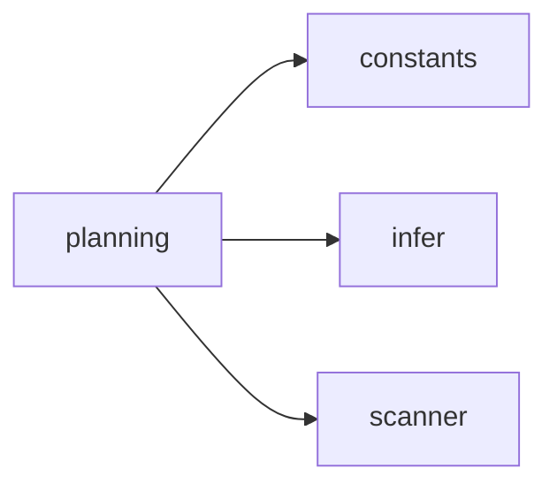

## When to Read
- editing or refactoring `planning.ts`

## Overview
- `src/graph-builder/messages/planning.ts` (70 lines · 1 top-level symbols) — Mirror — `src/graph-builder/messages/planning.ts` — **LLM prompt builder** (routing only; edit templates in repo)

## Graph


## Signatures

```typescript
// ── src/graph-builder/messages/planning.ts ──
export function buildPlanningPassMessage(scan: ScanResult): string { /* prompt template (~65 lines) */ }

```

## Dependencies
**Internal:**
- `src/graph-builder/constants`
- `src/graph-builder/plan/infer`
- `src/scanner`
