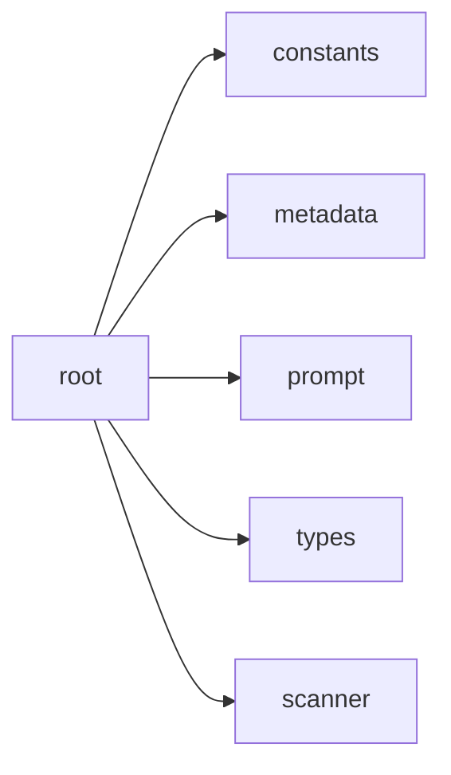

## When to Read
- editing or refactoring `root.ts`

## Overview
- `src/graph-builder/messages/root.ts` (130 lines · 1 top-level symbols) — Mirror — `src/graph-builder/messages/root.ts` — **LLM prompt builder** (routing only; edit templates in repo)

## Graph


## Signatures

```typescript
// ── src/graph-builder/messages/root.ts ──
export function buildRootPassMessage( today: string, scanPrompt: ScanResult, plan: BuildPlan | undefined, scanFull: ScanResult, opts?: { /* prompt template (~116 lines) */ }

```

## Dependencies
**Internal:**
- `src/graph-builder/constants`
- `src/graph-builder/deterministic/metadata`
- `src/graph-builder/deterministic/root`
- `src/graph-builder/prompt`
- `src/graph-builder/types`
- `src/scanner`
