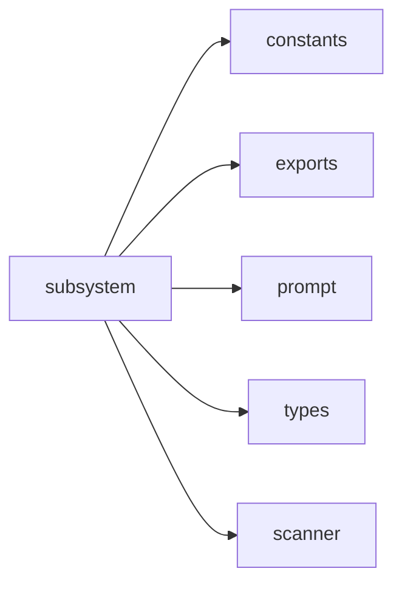

## When to Read
- editing or refactoring `subsystem.ts`

## Overview
- `src/graph-builder/messages/subsystem.ts` (164 lines · 3 top-level symbols) — Mirror — `src/graph-builder/messages/subsystem.ts` — **LLM prompt builder** (routing only; edit templates in repo)

## Graph


## Signatures

```typescript
// ── src/graph-builder/messages/subsystem.ts ──
export function buildFocusedContext(scan: ScanResult, sourceFiles: string[], subsystemName: string): string { /* ~21 lines */ }
export function buildSubsystemPassMessage( today: string, subsystemPath: string, rootGraphContent: string, scanPrompt: ScanResult, scanFull: ScanResult, sourceFiles: string[], planItem?: BuildPlanI… { /* prompt template (~96 lines) */ }
export function buildUserMessage(mode: BuildMode, scan: ScanResult, opts: BuildOptions): string { /* prompt template (~37 lines) */ }

```

## Dependencies
**Internal:**
- `src/graph-builder/constants`
- `src/graph-builder/extract/exports`
- `src/graph-builder/prompt`
- `src/graph-builder/types`
- `src/scanner`
