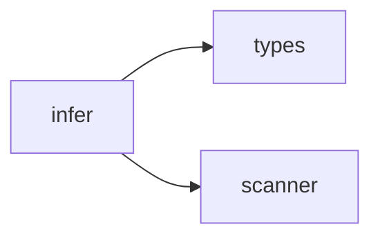

## When to Read
- editing or refactoring `infer.ts`

## Overview
- `src/graph-builder/plan/infer.ts` (119 lines · 5 top-level symbols) — Mirror — `src/graph-builder/plan/infer.ts`

## Graph


## Signatures

```typescript
// ── src/graph-builder/plan/infer.ts ──
export function buildPlanningContextLight(scan: ScanResult): string { /* ~23 lines */ }
export function readPackageJson(scan: ScanResult): Record<string, unknown> | null { const f = scan.files.find(x => x.path === 'package.json' && x.content); if (!f) return null; try { return JSON.parse(f.content) as Record<string, unknown…
export function readGoModModule(scan: ScanResult): string | null { const f = scan.files.find(x => x.path === 'go.mod' && x.content); if (!f) return null; const m = f.content.match(/^module\s+(\S+)/m); return m ? m[1].trim() : null; }
export function readComposerJson(scan: ScanResult): Record<string, unknown> | null { const f = scan.files.find(x => x.path === 'composer.json' && x.content); if (!f) return null; try { return JSON.parse(f.content) as Record<string, unkno…
export function inferDefaultsFromScan(scan: ScanResult): Pick<BuildPlan, 'projectName' | 'projectDescription' | 'techStack' | 'buildCommand' | 'testCommand'> { /* ~63 lines */ }

```

## Dependencies
**Internal:**
- `src/graph-builder/types`
- `src/scanner`
