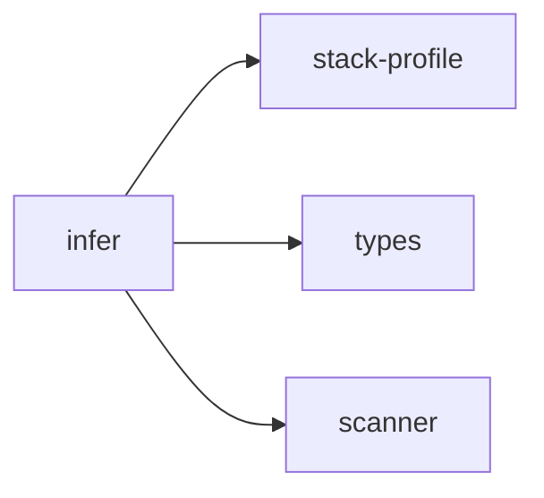

## When to Read
- editing or refactoring `infer.ts`

## Overview
- `src/graph-builder/plan/infer.ts` (225 lines · 8 top-level symbols) — Mirror — `src/graph-builder/plan/infer.ts`

## Graph


## Signatures

```typescript
// ── src/graph-builder/plan/infer.ts ──
export function buildPlanningContextLight(scan: ScanResult): string { /* ~29 lines */ }
export function readPackageJsonAt( scan: ScanResult, relPath: string ): Record<string, unknown> | null { const f = scan.files.find(x => x.path === relPath && x.content); if (!f) return null; try { return JSON.parse(f.content) as Record<s…
export function readPackageJson(scan: ScanResult): Record<string, unknown> | null { return readPackageJsonAt(scan, resolvePrimaryPackagePath(scan)); }
export function readGoModModule(scan: ScanResult): string | null { const f = scan.files.find(x => x.path === 'go.mod' && x.content); if (!f) return null; const m = f.content.match(/^module\s+(\S+)/m); return m ? m[1].trim() : null; }
export function readComposerJson(scan: ScanResult): Record<string, unknown> | null { const f = scan.files.find(x => x.path === 'composer.json' && x.content); if (!f) return null; try { return JSON.parse(f.content) as Record<string, unkno…
/** Which `package.json` drives build/test labels (nested Nuxt monorepos). */
export function resolvePrimaryPackagePath(scan: ScanResult): string { const nuxtConfig = findNuxtConfigPath(scan); if (nuxtConfig) { const dir = path.posix.dirname(nuxtConfig.replace(/\\/g, '/')); const nested = dir === '.' ? 'package.js…
/** Human stack line — avoids listing Go/Python/TS from a few stray scripts. */
export function inferTechStackFromScan( scan: ScanResult, profile: ProjectStackProfile ): string[] { /* ~45 lines */ }
export function inferDefaultsFromScan(scan: ScanResult): Pick<BuildPlan, 'projectName' | 'projectDescription' | 'techStack' | 'buildCommand' | 'testCommand'> { /* ~76 lines */ }

```

## Dependencies
**Internal:**
- `src/graph-builder/plan/stack-profile`
- `src/graph-builder/types`
- `src/scanner`
